# three.ws — Architecture Overview

*Last updated: 2026-06-26*

---

## Platform Vision

three.ws is a full-stack AI agent platform where agents own wallets, launch tokens, trade autonomously, and inhabit 3D worlds. It competes directly with the best agent platforms, marketplaces, and creator tools in the world — Linear for developer experience, Vercel for deployment polish, Stripe for payment infrastructure — applied to the intersection of generative AI, real-time 3D, and on-chain commerce. What makes it unique: every agent is simultaneously a 3D embodied character, a Solana wallet, an MCP tool server, and a tradeable economic entity — all wired together through a real micropayment rail (x402 + USDC) that works agent-to-agent without human intervention.

---

## System Architecture Diagram

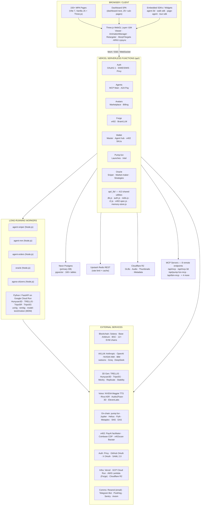

---

## Domain Map

### Top-Level Domains

| Domain | Primary Paths | Status | Description |
|--------|--------------|--------|-------------|
| Frontend App | `pages/` · `src/` · `public/` | active | 150+ MPA pages, dashboard SPA, public surfaces |
| API Layer | `api/` | active | 1,209 Vercel serverless functions across 130+ feature dirs |
| 3D / Avatar / Animation | `src/glb-canonicalize.js` · `src/animation-*` · SDKs | active | Full avatar pipeline, rig-agnostic retargeting |
| MCP Layer | `api/mcp*` · `mcp-server/` · `mcp-bridge/` · `packages/*-mcp` | active/published | 8 remote + 2 npm + 30 standalone MCP servers |
| SDK Ecosystem | `sdk/` · `*-sdk/` · `packages/` | published | 60+ published npm packages |
| On-chain / Contracts | `contracts/` | active | 2 Anchor programs, 4 Solidity contracts, 12+ EVM chains |
| x402 / Payments | `api/x402*` · `api/bazaar/` · `api/marketplace/` | active | Full micropayment + marketplace stack |
| AI / Agent Intelligence | `api/chat.js` · `api/brain/` · `workers/` | active | Multi-provider LLM, memory, multimodal |
| Pump.fun / Token Launch | `api/pump/` · `workers/agent-sniper/` | active | Launch, trade, community, oracle |
| Infrastructure | `vercel.json` · `infra/` · `deploy/` | active | Vercel, GCP Cloud Run, AWS CDK |

---

## Frontend Application

### Routing Architecture

three.ws is a **Multi-Page Application (MPA)** with no client-side router framework. Each page is an independent HTML/JS Vite entry point. Vite dev middleware handles URL rewrites that mirror production Vercel routes. The one exception is `pages/dashboard-next/` — a full SPA shell with 25+ sub-pages loaded dynamically by `src/dashboard-next/shell.js`.

**Build:** `npm run dev` (port 3000), `npm run build` (Vite 7 MPA). All 150+ HTML files are auto-resolved as entry points in `vite.config.js`.

**Dev API proxy:** `/api/*` proxies to `DEV_API_PROXY` (default: `https://three.ws`).

---

### Core 3D & Agent Surfaces

| Surface | Route | HTML | JS Controller | Description |
|---------|-------|------|---------------|-------------|
| Home / Landing | `/` | `pages/home.html` | `src/app.js` (partial) | Walk companion, footer-bot, hero stage, live token ticker |
| 3D Viewer / App | `/app` | `pages/app.html` | `src/app.js` | Core GLB viewer: material editor, texture inspector, scene explorer, magic brush, Runtime LLM brain, widget system, drop-zone upload |
| Agent Edit | `/agent/:id/edit`, `/agent/new` | `pages/agent-edit.html` | `src/agent-edit.js` | Full agent editor: name, description, avatar picker, skills config, wallet chips, mood engine, autopilot brain |
| Create Agent | `/create-agent` | `pages/create-agent.html` | `src/create-agent.js` | 5-step wizard: Basics → 3D Model → Skills → Personality → Review |
| Agent Detail | `/agent/:id` | `pages/agent-detail.html` | `src/agent-detail.js` | Live wallet pulse, mirror panel, strategy panel, patronage, validation badge, WebGL avatar, on-chain status, coin launch history |
| Agent Wallet Hub | `/agent/:id/wallet` | `pages/agent-wallet.html` | `src/agent-wallet-hub/index.js` | 19-tab Solana wallet: Balance, Portfolio, Deposit, Trade, Snipe, Orders, Earn, Autopilot, Intents, Signals, Pay, Vanity, Policy, Withdraw, Give, Access, Recovery, Guard, Proof |
| Agent Mind Palace | `/agent/:id/mind` | `pages/agent-mind.html` | `src/agent-mind.js` + `src/mind-palace.js` | Visual 3D memory graph |
| Agent Studio | `/agent/:id/studio` | `pages/agent-studio.html` | `src/studio/studio-shell.js` | Tabs: Brain, Memory, Body, Money, Skills |
| Marketplace | `/marketplace` | `pages/marketplace.html` | `src/marketplace.js` | Agent + skill discovery: category sidebar, search, list+detail SPA |
| @Handle Profile | `/@:handle` | `pages/handle.html` | `src/handle.js` | Public live profile with embedded avatar iframe |

---

### Dashboard (Next) — SPA Shell

**Path:** `pages/dashboard-next/*.html` + `src/dashboard-next/shell.js`

25+ sub-pages loaded dynamically via `src/dashboard-next/pages/*.js`:

| Sub-page | File | Description |
|----------|------|-------------|
| Home | `pages/home.js` | Agent list, revenue, activity feed |
| Agents | `pages/agents.js` | Manage owned agents |
| Avatars | `pages/avatars.js` | Avatar gallery + editor |
| Tokens | `pages/tokens.js` | Launched tokens dashboard |
| Analytics | `pages/analytics.js` | Platform analytics |
| Monetize | `pages/monetize.js` | Subscription plans, skill pricing, payouts |
| Account | `pages/account.js` | Profile, auth, wallet |
| Settings | `pages/settings.js` | Platform settings |
| Widgets | `pages/widgets.js` | Embeddable widget builder |
| Wallet Grinder | `pages/wallet-grinder.js` | Vanity address grinder UI |
| Sniper | `pages/sniper.js` | Sniper strategy config |
| Holders | `pages/holders.js` | $THREE holder management |
| Brain | `pages/brain.js` | LLM persona builder |
| Walk | `pages/walk.js` | Walk SDK config |
| IRL Placements | `pages/irl-placements.js` | AR placement management |
| Library | `pages/library.js` | Asset library |
| Portfolio | `pages/portfolio.js` | On-chain portfolio view |
| Transactions | `pages/transactions.js` | Transaction history |
| Copy | `pages/copy.js` | Copy trading settings |
| Creator | `pages/creator.js` | Creator dashboard |
| Referrals | `pages/referrals.js` | Referral program |
| API | `pages/api.js` | API key management |
| Developers | `pages/developers.js` | Developer docs |
| Landscape | `pages/landscape.js` | Market landscape view |
| Three-Token | `pages/three-token.js` | $THREE token stats |
| Prelaunch Radar | `pages/prelaunch-radar.js` | Pre-launch signal feed (gated) |

---

### Trading & Market Intelligence

| Surface | Route | JS Controller | Data Source |
|---------|-------|---------------|-------------|
| Oracle | `/oracle` | `src/oracle.js` | `GET /api/oracle/*` (SSE feed, wallet rep, conviction) |
| Radar | `/radar` | `src/radar.js` | `GET /api/pump/coin-intel` (SSE) |
| Watchlist | `/watchlist` | `src/watchlist.js` | `localStorage` + live market enrichment |
| Pulse (Money Pulse) | `/pulse` | `src/pulse.js` | `GET /api/pulse` (SSE) + stats view |
| Alpha Co-pilot | `/alpha-copilot` | `src/alpha-copilot.js` | `/api/agents/:id/alpha/read` → TTS → avatar lip-sync |
| Trader Profile | `/trader/:id` | `src/trader.js` | `GET /api/sniper/trader/:id` + leaderboard |
| Leaderboard | `/leaderboard` | `src/leaderboard.js` | `GET /api/sniper/leaderboard` |
| Signals Marketplace | `/signals` | `src/signals.js` | `GET /api/signals/marketplace` |
| Strategies Library | `/strategies` | `src/strategies.js` | `GET /api/strategies` |
| Swarms | `/swarms` | `src/swarms.js` | `GET /api/swarms/*` |
| Vaults | `/vaults` | `src/vaults.js` | `GET /api/vaults/*` |
| Mirror (Copy Trading) | `/mirror` | `src/mirror.js` | `GET /api/mirror/leaderboard` |
| Terminal / Mission Control | `/terminal` | `src/mission-control/index.js` | Multi-SSE fusion (intel, oracle, feed) + trade execution |
| Arena (Tournaments) | `/arena` | `src/arena/arena.js` | SSE rank stream, `GET /api/tournaments/*` |

---

### 3D World Surfaces

| Surface | Route | JS Controller | Description |
|---------|-------|---------------|-------------|
| Walk (3D Walkaround) | `/walk` | `src/walk.js` + `walk-sdk/` | WASD + joystick, Colyseus multiplayer, AR toggle, voice chat |
| Club (Pole Club) | `/club` | `src/club.js` | x402 tip-to-dance: USDC gated Three.js dance routines |
| Theater (Live Trading) | `/theater` | `src/theater.js` | Spectator: agent avatars on real on-chain events |
| Stage (Living Stages) | `/stage` | `src/stage.js` | Embodied host, spatial voice, crowd reactions, $THREE tips |
| Agora (Commons) | `/agora` | `src/agora/agora-world.js` | 3D Manhattan city, job board, passport, trust surface |
| Galaxy / Agent Galaxy | `/galaxy` | `src/galaxy.js` | 3D star-map via IBM Granite embeddings (watsonx.ai) |
| Constellation | `/constellation` | `src/constellation/main.js` | Trending Solana tokens in semantic space via PCA |
| Coin3D | `/coin3d` | `src/coin3d/main.js` | Live 3D snapshot of any pump.fun token |
| Communities | `/communities` | `src/communities.js` | Entry into coin-specific multiplayer 3D worlds |
| IRL (AR Placement) | `/irl` | `src/irl.js` + `src/irl/` | Mobile AR: GPS/marker/room anchor modes |
| City | `/city` | `src/city/city-scene.js` | OpenStreetMap Manhattan 3D substrate |
| Play (Coin World Game) | `/play` | `src/game/play-systems.js` | Full 3D game: home town, vehicles, NPC crowd, missions |
| Diorama | `/diorama` | `src/diorama/` | 3D scene composer, drag/drop placement |

---

### Creation & Generation Tools

| Surface | Route | JS Controller | Description |
|---------|-------|---------------|-------------|
| Forge | `/forge` | `src/forge.js` | Text/image/sketch → 3D via TRELLIS/TripoSG; access-gated by $THREE tier |
| Avatar Studio | `/avatar-studio` | `src/avatar-studio.js` | Build avatar from base template: sculpt morphs, colorpicker, accessories, GLTFExporter |
| Avatar Edit | `/avatars/:id/edit` | `src/avatar-edit.js` | Edit existing avatar: outfit, face sculpt, re-export GLB |
| Avatar Page | `/avatars/:id` | `src/avatar-page.js` | Public avatar showcase |
| Forge Studio | `/forge-studio` | `src/editor/launchpad-studio.js` | Full-featured launchpad/embed editor: persona interview, manifest builder, magic brush |
| Mocap Studio | `/mocap-studio` | `src/mocap-studio.js` | MediaPipe face+body mocap → GLB animation export |
| Pose Studio | `/pose` | `src/pose-studio.js` | Avatar pose capture, library, share, thumbnail |
| Voice Lab | `/voice` | `src/voice-lab.js` + `src/voice/` | Voice clone, TTS testing, lip-sync driver, LiveKit spatial voice |
| AR Experience | `/avatars/:id/ar` | `src/ar-page.js` + `src/ar/` | WebXR + ARKit Quick Look + Android Scene Viewer |

---

### Launches, Token & Community

| Surface | Route | JS Controller | Data Source |
|---------|-------|---------------|-------------|
| Launches Feed | `/launches` | `src/launches.js` | `GET /api/pump/launches` (60s live refresh) |
| Launch Detail | `/launches/:mint` | `src/launch-detail.js` | Price, bonding curve, holder bubblemap, oracle conviction |
| $THREE Token Page | `/three-token` | `src/three-token-page.js` | Live price, bonding curve chart, Jupiter swap modal |
| Autopilot | `/autopilot` | `src/autopilot.js` | Per-coin buyback/distribute policy, agent avatar narration |
| Pump Dashboard | `/pump-dashboard` | `src/launchpad/` | Pump.fun token creator dashboard |
| AGI Surface | `/agi` | `src/agi.js` | Autonomous trading agent with live decision stream |
| Reasoning Ledger | `/reasoning-ledger` | `src/reasoning-ledger.js` | Agent decision timeline with calibration chart |
| Bounties | `/bounties` | `src/bounties.js` | pump.fun GO bounty board |
| Labor Market | `/labor-market` | `src/labor-market.js` | Machine economy: bounties, jobs, on-chain escrow |
| Claim Wallet | `/claim-wallet` | `src/claim-wallet.js` | Paste Solana wallet → full pump.fun trading report, claim via SIWS |

---

### x402 & Payment Surfaces

| Surface | Route | Description |
|---------|-------|-------------|
| x402 Pay Demo | `/pay` | `public/pay/index.html` — live demo: agent pays $0.001 USDC per MCP tool call |
| x402 Bazaar | `/bazaar` | `public/bazaar.html` — discover and try paid x402 services |
| Hosted Checkout | `/pay/c/:slug` | `public/pay/c/index.html` — merchant checkout page |
| Paid Call Receipt | `/pay/calls/:tx` | Transaction receipt with Solscan link |
| Hosted Storefront | `/store/:handle` | Merchant's drag-drop customizable storefront |
| CA → x402 Converter | `/ca2x402` | Paste token CA → get live payable x402 endpoint for market intel |
| x402 Studio | `/x402/studio` | Build and test paid endpoints |
| x402 Dashboard | `/dashboard/x402` | SKU management for merchants |

---

### Auth, Identity & Discovery

| Surface | Route | Description |
|---------|-------|-------------|
| Login | `/login` | `public/login.html` + `src/privy-login.js` — email OTP, EVM SIWE, Solana SIWS |
| Register | `/register` | `public/register.html` |
| Discover (ERC-8004) | `/discover` | `public/discover/index.html` — ERC-8004 agent marketplace, chain filter, pagination |
| My Agents | `/my-agents` | `public/my-agents/index.html` — native + ERC-8004 on-chain agents |
| Agents Directory | `/agents` | `public/agents/index.html` — public agent directory |
| Gallery | `/gallery` | `public/gallery/index.html` — public avatar gallery |
| Studio (Scene Studio) | `/studio` | `public/studio/index.html` — vendored Three.js editor r184 |
| Validation | `/validation` | `public/validation/index.html` — GLB/GLTF validator |
| Reputation (EAS) | `/reputation` | `public/reputation/index.html` — read/write EAS attestations |
| Hydrate (ERC-8004) | `/hydrate` | `public/hydrate/index.html` — on-chain agent hydration tool |
| Vanity Wallet | `/vanity-wallet` | `public/vanity-wallet.html` — browser-side Solana vanity address grinder |
| ETH Vanity | `/eth-vanity` | `public/eth-vanity.html` — browser-side EVM vanity address grinder |
| Brain (Persona Builder) | `/brain` | `pages/brain.html` — 14-provider LLM playground |
| IBM Suite | `/ibm/*` | `pages/ibm/` — IBM watsonx.ai integration pages |

---

### Key Shared Frontend Modules

| Module | Path | Purpose |
|--------|------|---------|
| `<agent-3d>` web component | `src/element.js` | Heavy avatar web component: chat loop, voice, lipsync, emotion |
| `<agent-stage>` element | `src/shared/agent-3d.js` | Lightweight avatar stage for embed contexts |
| Agent Wallet Chip | `src/shared/agent-wallet-chip.js` | Wallet balance/action chip, reused across surfaces |
| Money Pulse | `src/shared/money-pulse.js` | SSE-driven live wallet activity feed |
| State Kit | `src/shared/state-kit.js` | Shared reactive state primitives |
| List Controls | `src/shared/list-controls.js` | Reusable sort/filter/search controls |
| Three Access | `src/three-access.js` | $THREE token-gated feature unlock |
| Three Gate | `src/three-gate.js` | Browser-side tier pass verification |
| i18n | `src/i18n.js` | `data-i18n` DOM annotations + `/locales/*.json` catalogs |
| Notifications | `src/notifications.js` | In-app notification inbox |
| Analytics | `src/analytics.js` | PostHog integration |
| Privy Login | `src/privy-login.js` | Email OTP + EVM SIWE + Solana SIWS |

---

## API Layer

The API layer is **1,209 JavaScript files** across `api/`, organized as Vercel serverless functions (Node.js ESM). All functions share a `api/_lib/` utility layer (413 files).

### Authentication Patterns

Every request passes through one of four auth gates:

1. **Session cookie** (`__Host-sid`) — set by `api/auth/[action].js`, verified by `api/_lib/auth.js`
2. **OAuth 2.1 Bearer token** — issued by `api/oauth/[action].js`, verified per-request
3. **x402 X-PAYMENT header** — verified by `api/_lib/x402-spec.js` via PayAI or CDP facilitator
4. **CRON_SECRET Bearer** — for `api/cron/*` scheduled jobs

### Core Utility Modules (`api/_lib/`)

| Module | Purpose |
|--------|---------|
| `db.js` | Neon Postgres HTTP driver, composable `sql` tagged template, NUL-byte stripping |
| `auth.js` | Session verification, SIWE, SIWS, Privy JWKS verification |
| `env.js` | Centralized environment variable access with `req()` / `opt()` guards |
| `redis.js` | Upstash Redis singleton, in-memory fallback |
| `cache.js` | Response caching layer over Redis |
| `r2.js` | Cloudflare R2 / S3-compatible blob storage via `@aws-sdk/client-s3` |
| `http.js` | Shared HTTP helpers, CORS, error responses |
| `rate-limit.js` | Per-IP and per-user rate limiting via `@upstash/ratelimit` |
| `x402-spec.js` | CDP x402 v2 payment verification + settlement |
| `x402-paid-endpoint.js` | `paidEndpoint()` factory — wraps any handler with 402 challenge |
| `x402.js` | pump.fun agent-payments 402 protocol (separate from CDP x402) |
| `agent-wallet.js` | Custodial agent keypair load/encrypt/decrypt (AES-256-GCM) |
| `memory-store.js` | Tiered memory engine (working/recall/archival, pgvector embeddings) |
| `granite-guardian.js` | IBM Granite Guardian 12-risk taxonomy safety gate |
| `three-tier.js` | $THREE holder tier resolution (Genesis/Diamond/Platinum/Gold/Silver/Bronze) |
| `three-gate.js` | $THREE token balance check (Redis-cached 30s, fails open on RPC error) |
| `pump-launch.js` | Core pump.fun token launch helpers |
| `forge-tiers.js` | 3D generation backend selector by tier |
| `agent-identity.js` | Agent identity resolution + ERC-8004 registry |
| `marketplace-platform-fee.js` | Fee split calculations (MARKETPLACE_PLATFORM_FEE_BPS, default 0) |

---

### API Endpoints by Feature Area

#### Authentication & Identity (`api/auth/`, `api/oauth/`)

| Endpoint | Method | Description |
|----------|--------|-------------|
| `/api/auth/[action]` | GET/POST | login, register, logout, me, profile, forgot-password, reset-password, verify-email |
| `/api/auth/siwe` | POST | Ethereum Sign-In-With-Ethereum |
| `/api/auth/siws` | POST | Solana Sign-In-With-Solana |
| `/api/auth/saml/*` | GET/POST | SAML 2.0 SSO (IBM Cloud App ID, Okta, Azure AD) |
| `/api/oauth/[action]` | GET/POST | authorize, token (code + PKCE + refresh), dynamic client registration (RFC 7591), revoke, introspect |

**DB tables:** `users`, `sessions`, `password_resets`, `email_verifications`, `oauth_clients`, `oauth_refresh_tokens`

#### Agents (`api/agents.js`, `api/agents/[id].js`, `api/agents/*`)

| Endpoint | Method | Description |
|----------|--------|-------------|
| `/api/agents` | GET/POST | List agents, create agent |
| `/api/agents/:id` | GET/PUT/DELETE | Agent CRUD |
| `/api/agents/:id/wallet` | GET | Solana wallet address + balance |
| `/api/agents/:id/trade` | POST | Guarded trade execution from agent wallet |
| `/api/agents/:id/autopilot` | GET/POST | Per-agent autopilot policy config |
| `/api/agents/:id/memory` | GET/POST/DELETE | Agent memory CRUD |
| `/api/agents/:id/brain` | GET/PUT | Persona + LLM config |
| `/api/agents/:id/voice-clone` | POST | ElevenLabs voice clone |
| `/api/agents/:id/embed` | GET | Embedding vector (NIM or VoyageAI) |
| `/api/agents/:id/strategies` | GET/POST | Agent strategy management |
| `/api/agents/:id/sns` | POST | Mint `*.threews.sol` subdomain |
| `/api/agents/a2a-mandate` | POST | Issue JWS A2A mandate (user consent) |
| `/api/agents/a2a-call` | POST | Execute mandate-authorized autonomous USDC payment |
| `/api/agents/a2a-hire` | POST | Post task to labor market |
| `/api/agents/a2a-paid` | POST | Invoice verification |

#### MCP Servers (`api/mcp.js`, `api/mcp-3d.js`, `api/mcp-studio.js`, `api/mcp-agent.js`, `api/mcp-bazaar.js`, `api/ibm-mcp.js`, `api/pump-fun-mcp.js`, `api/chat/mcp.js`)

See [MCP Layer](#mcp-layer) section for full tool listings.

#### 3D Forge (`api/forge.js`, `api/forge-*.js`)

| Endpoint | Description |
|----------|-------------|
| `POST /api/forge` | Text/image/sketch → 3D; selects backend by tier (Meshy/Tripo/Replicate/GCP/HuggingFace/NVIDIA NIM) |
| `GET /api/forge/:jobId` | Poll job status |
| `POST /api/forge-rembg` | Background removal |
| `POST /api/forge-remesh` | Remesh geometry |
| `POST /api/forge-segment` | Mesh segmentation |
| `POST /api/forge-stylize` | Style transfer |
| `POST /api/forge-enhance` | Quality enhancement |
| `GET /api/forge-gallery` | Public forge creations |

**3D generation backends:** TRELLIS · TripoSG · Tripo3D · Meshy · Rodin · Replicate · GCP Vertex · HuggingFace · NVIDIA NIM

#### Pump.fun (`api/pump/[action].js`)

40+ actions dispatched via a single `[action].js` handler:

| Action Group | Actions |
|-------------|---------|
| Launch | `launch-prep`, `launch-confirm`, `launch-agent` (server-signed) |
| Trading | `buy`, `sell`, `quote`, `portfolio`, `balances` |
| Fee Sharing | `fee-sharing-create`, `fee-sharing-update`, `fee-sharing-collect`, `fee-sharing-distribute` |
| Market Data | `trending`, `smart-money`, `coin-intel` (SSE), `live-stream` (SSE), `by-agent` |
| Governance | `governance`, `strategy-backtest`, `strategy-run`, `strategy-validate` |
| Autopilot | `autopilot`, `run-buyback`, `run-distribute-payments` |
| Safety | `safety` (honeypot detection), `withdraw` |

#### x402 Paid Endpoints (`api/x402/*`)

~25 individual paid endpoints built on `paidEndpoint()`:

| Endpoint | Price | Description |
|----------|-------|-------------|
| `pump-launch.js` | $5.00 USDC | Anonymous token launch |
| `skill-marketplace.js` | $0.001 USDC | Skill marketplace query |
| `skill-call.js` | variable | Per-call skill billing to author wallet |
| `token-intel.js` | $0.01 USDC | Token market intelligence (aixbt bridge) |
| `asset-download.js` | variable | Creator USDC payout download |
| `dance-tip.js` | variable | Club tip-to-dance trigger |
| `animation-download.js` | variable | Animation clip download |
| `fact-check.js` | $0.001 USDC | AI fact checking |
| `vanity.js` | variable | Hosted vanity address grinding |
| `tutor.js` | variable | AI tutoring session |
| `agent-bouncer.js` | variable | Agent access control |
| `onchain-identity-verify.js` | variable | On-chain identity verification |
| `mint-to-mesh.js` | variable | Token CA → themed 3D mesh |
| `crypto-intel.js` | $0.01 USDC | Crypto market intelligence |
| `forge.js` | tier-based | 3D generation (Forge x402 lane) |

#### x402 Infrastructure (`api/x402-*`)

| Endpoint | Description |
|----------|-------------|
| `POST /api/x402-pay` | Server-side x402 payer (internal + external); SSE lifecycle stream |
| `GET/POST /api/x402-checkout` | Drop-in modal: `prepare` (unsigned Solana tx) + `encode` (sign → X-PAYMENT header) |
| `POST /api/x402-checkout-record` | Analytics recording for completed checkouts |
| `GET/PUT /api/x402-merchant` | Merchant console: payout wallets, CORS, spend caps, API keys, storefront |
| `GET/POST/PUT/DELETE /api/x402-skus` | SKU management: slug → target endpoint + branding + stats |
| `GET /api/x402-status` | Health probe: facilitators, SIWX table, supported networks |

#### Bazaar (`api/bazaar/*`)

| Endpoint | Description |
|----------|-------------|
| `GET /api/bazaar/list` | Paginated catalog from PayAI + CDP facilitators |
| `GET /api/bazaar/search` | Ranked text search across bazaar |
| `GET /api/bazaar/providers` | Per-host reputation cards |
| `GET /api/bazaar/arbitrage` | Cross-venue price disparity |
| `GET /api/bazaar/context` | Contextual service suggestions |

#### Wallet Management (`api/user/wallet/*`, `api/wallet/`)

| Endpoint | Description |
|----------|-------------|
| `GET/POST /api/user/wallet` | Platform-custodied EVM + Solana wallet: addresses + balances |
| `POST /api/user/wallet/fund-agent` | Transfer USDC/SOL to agent wallets |
| `GET /api/user/wallet/history` | On-chain Solana transaction history |
| `POST /api/user/wallet/send` | USDC/SOL to any address |

**Encryption:** AES-256-GCM for custodial keypair at rest (`WALLET_ENCRYPTION_KEY`, falls back to `JWT_SECRET` with warning if unset).

#### Brain / LLM (`api/brain/chat.js`, `api/chat.js`, `api/llm/anthropic.js`)

| Endpoint | Description |
|----------|-------------|
| `POST /api/brain/chat` | Multi-provider LLM playground (20+ models, SSE streaming) |
| `POST /api/chat` | Avatar chat endpoint: memory recall, tool dispatch, Guardian governance |
| `POST /api/llm/anthropic` | We-pay proxy for Anthropic Claude (embed contexts, free tier) |

**Provider failover in `/api/chat`:** Groq → OpenRouter → NVIDIA NIM → Anthropic → OpenAI → watsonx/Orchestrate

#### Voice & Multimodal (`api/tts/`, `api/asr.js`, `api/a2f.js`, `api/vision.js`)

| Endpoint | Backend | Description |
|----------|---------|-------------|
| `POST /api/tts/speak` | NVIDIA Magpie (primary), OpenAI TTS (backstop) | Text → speech |
| `POST /api/asr` | NVIDIA Riva (gRPC) | Speech → text |
| `POST /api/a2f` | NVIDIA Audio2Face-3D (gRPC) | Audio → ARKit 52 blendshapes |
| `POST /api/vision` | NVIDIA NIM VLM → OpenAI gpt-4o-mini (backstop) | Image understanding |
| `POST /api/cosmos` | NVIDIA Cosmos | Text → world video (MP4, async) |

#### Memory (`api/agent-memory.js`, `api/memory/*`)

| Endpoint | Description |
|----------|-------------|
| `GET/POST/DELETE /api/agent-memory` | Agent memory CRUD; ERC-191 signed writes |
| `POST /api/memory/search` | Semantic + lexical search over `agent_memories` (pgvector cosine) |
| `GET /api/memory/context` | Working-tier token-budgeted context assembly |
| `POST /api/memory/curate` | Memory curation |
| `GET /api/memory/graph` | Entity knowledge graph (Zep/Graphiti-style temporal KG) |

#### Marketplace (`api/marketplace/[action].js`)

| Action | Description |
|--------|-------------|
| `agents` | List/search marketplace agents |
| `create` / `publish` | Create and publish agent |
| `fork` | Fork an existing agent |
| `purchase` | Buy agent/skill via Solana Pay |
| `purchase-as-agent` | Autonomous agent-to-agent purchase |
| `purchase-bundle` | Bundle purchase |
| `set-skill-price` | Revenue split pricing CRUD |
| `check-skill-access` | License verification |
| `start-trial` | Trial period initiation |
| `buy-asset` | Buy avatars/agents/plugins |
| `reviews` | Read/write reviews |
| `analytics` | Skill revenue analytics |

#### Cron Jobs (`api/cron/`) — 33 scheduled functions

| Cron | Schedule | Description |
|------|----------|-------------|
| `oracle-score` | frequent | LLM coin scoring + conviction updates |
| `oracle-digest` | daily | Oracle summary generation |
| `pulse-tick` | per-minute | Platform activity aggregation |
| `three-holders-snapshot` | daily | $THREE holder leaderboard snapshot via Helius |
| `rewards-distribute` | weekly | Batch SPL rewards to $THREE holders |
| `smart-money-rollup` | hourly | Cross-reference graduations → wallet track records |
| `signal-fanout` | frequent | Signal marketplace delivery |
| `copy-fanout` | frequent | Copy trading order replication |
| `mirror-fanout` | frequent | Mirror trading order replication |
| `strategy-fanout` | frequent | Strategy execution loop |
| `reflect-sweep` | daily | LLM reflection synthesis for agents |
| `intel-learn` | frequent | Coin intel classifier learning pass |
| `gmgn-seed` | hourly | GMGN smart-money data seeding |
| `radar-watchlist` | frequent | Pre-launch radar watchlist update |
| `reputation-recompute` | daily | Wallet reputation recalculation |
| `erc8004-crawl` | hourly | Etherscan V2 ERC-8004 event indexing |
| `avaturn-seed-cron` | daily | Avaturn avatar seeding |
| `forge-seed` / `forge-smoke` | daily | Forge gallery seeding + smoke test |
| `wallet-intents` | frequent | Agent wallet intent execution |
| `quota-check` | hourly | Upstash Redis quota monitoring |
| `uptime-check` | frequent | Platform endpoint health check |
| `world-health` | frequent | Multiplayer world health check |
| `flush-usage-events` | frequent | Usage event batch flush to billing |

---

## 3D & Avatar System

### Animation Pipeline (Build Time)

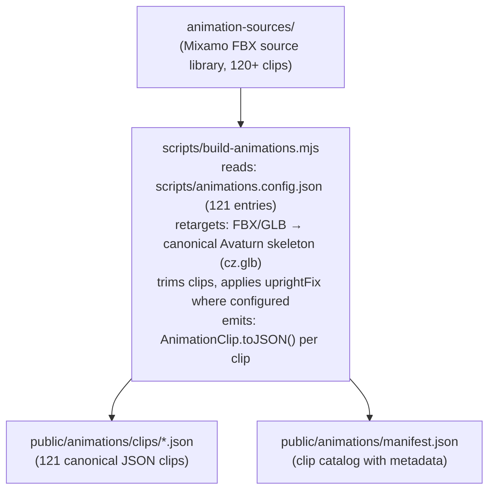

### Bone Canonicalization (`src/glb-canonicalize.js`)

The rig-agnostic bone canonicalizer rewrites any humanoid GLB's joint names to the canonical Avaturn bone set. Supported conventions:

| Convention | Bone Name Examples |
|-----------|-------------------|
| Mixamo | `mixamorigHips`, `mixamorigSpine` |
| Blender / Rigify | `DEF-spine`, `DEF-upper_arm.L` |
| CharacterStudio | `Bip01_Pelvis`, `Bip01_L_UpperArm` |
| HumanIK | `Reference`, `LeftUpLeg` |
| Unreal Engine | `root`, `pelvis`, `upperarm_l` |
| VRM 0.x / VRoid | `J_Bip_C_Hips`, `J_Bip_L_UpperArm` |
| VRM 1.0 | `hips`, `leftUpperArm` (camelCase) |
| Daz / Genesis | `hip`, `lCollar`, `lShldr` |
| MakeHuman | `upperleg01.L`, `clavicle_l` |
| Reallusion CC3/CC4 | `CC_Base_Hip`, `CC_Base_L_Upperarm` |
| 3ds Max Biped | `Bip001 Pelvis`, `Bip001 L UpperArm` |
| Generic snake/kebab | `left_upper_arm`, `left-upper-arm` |

Also folds Mixamo +90°X armature orientation correction.

### Animation Retargeter (`src/animation-retarget.js`)

Runtime world-delta-preserving retargeter. Three entry points:

| Function | Input | Description |
|----------|-------|-------------|
| `retargetClipToRig(clip, rig)` | `GltfRig` | Primary path for GLB skeletons |
| `retargetClipToObject(clip, object3D)` | `Object3D` graph | Walk SDK path |
| `retargetClip(clip, map, corrections)` | Low-level | Custom pipeline |

**Algorithm:** Builds canonical→node maps, computes bind corrections `L = Rt · WT⁻¹ · WS · Rs⁻¹`, corrects root motion for rig axis, scales hip translation for rig height.

### AnimationManager (`src/animation-manager.js`)

Central animation controller managing the full lifecycle:

- Loads/caches canonical JSON clips
- Retargets on `attach()` (lazy, concurrency=4)
- Crossfades between states
- Plays one-shots via `playOnce()` with settle
- Additive overlay for gesture-over-locomotion
- Fallen-pose guard (Hips tilt ≥45° off vertical)
- `supportsCanonicalClips()` gate — non-humanoid rigs fall back to default rig, never T-pose

### Animation State Machine (`src/animation-state-machine.js`)

Pure directed graph (no Three.js dependency, unit-testable):

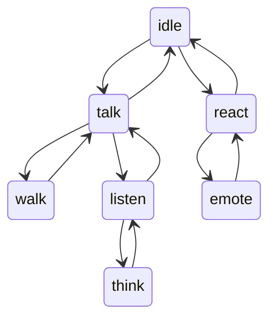

Driven by protocol events, delivers transitions via `onTransition` callback.

### Procedural Idle (`src/idle-animation.js`)

Four additive ambient channels:
- **Breathing:** spine micro-rotation (sinusoidal)
- **Saccades:** head yaw/pitch spring simulation
- **Blink:** morph target animation
- **Weight shift:** hip drift

Per-avatar seeded PRNG prevents multiple avatars from syncing.

### Lipsync Systems

**Audio-driven** (`src/voice/lipsync-driver.js`):
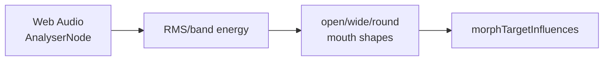

**Text-to-viseme heuristic** (`src/runtime/lipsync.js`, `page-agent-sdk/src/lipsync.js`):
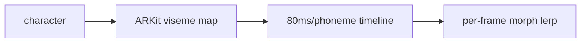

### ARKit 52 Blendshape System (`src/voice/arkit-blendshapes.js`)

Full 52-blendshape ARKit vocabulary with cross-format mapping. Falls back to jaw-only, then body-animation-only if morph targets absent.

### 3D Avatar SDKs

| SDK | Package | Path | Description |
|-----|---------|------|-------------|
| `<three-ws-viewer>` web component | `@three-ws/avatar` v0.2.0 | `avatar-sdk/src/viewer.js` | Lightweight GLB viewer: OrbitControls, PMREM, ResizeObserver |
| `<agent-3d>` web component | `@three-ws/avatar` v0.2.0 | `avatar-sdk/src/agent.js` | Full chat loop, voice, lipsync, emotion morphs (~3.3 MB) |
| AvatarCreator iframe modal | `@three-ws/avatar` v0.2.0 | `avatar-sdk/src/creator.js` | Opens Avatar Studio or Avaturn iframe, resolves to GLB Blob |
| Walk Companion | `@three-ws/walk` v0.1.0 | `walk-sdk/src/companion.js` | 200×280px fixed-position corner avatar |
| Walk Playground | `@three-ws/walk` v0.1.0 | `walk-sdk/src/playground.js` | Full-page stroll/platformer |
| Page Agent | `@three-ws/page-agent` v0.1.0 | `page-agent-sdk/src/page-agent.js` | Drop-in 3D narrator that auto-walks through page content |
| Tour SDK | `@three-ws/tour` v0.1.0 | `tour-sdk/src/director.js` | Guided product tour with TTS narration + sessionStorage resume |

### Body Mocap (`src/body-mocap.js`)

MediaPipe Pose Landmarker → 33 world landmarks → `pose-solve.js` → per-bone quaternion deltas → damped slerp → canonical bone names via `glb-canonicalize` → `bone.quaternion`.

### Animated USDZ Export (`src/usdz-animated.js`)

Bakes skinned mesh vertex positions at N keyframes, surgically rewrites `USDZExporter` ZIP output to add time-sampled point arrays. Fallback to static USDZ on failure. Enables iOS AR Quick Look animated avatars.

### Auto-Rig API (`api/_lib/auto-rig.js`)

Static mesh uploads → UniRig/Replicate backend → poll `regenerate-status` → canonicalize bones → register as new sibling avatar. Non-destructive. Feature-gated via `/api/config features.avatarRigging`.

---

## MCP Layer

three.ws exposes **~311 total MCP tools** across a multi-tier server architecture.

### MCP Protocol

All remote servers implement **MCP 2025-06-18 Streamable HTTP transport** (JSON-RPC 2.0). npm stdio servers use `@modelcontextprotocol/sdk` StdioServerTransport.

### Remote MCP Servers (Vercel-hosted)

| Server | Endpoint | Tools | Auth | Registry ID |
|--------|----------|-------|------|-------------|
| Main | `/api/mcp` | ~34 | OAuth or x402 USDC | `io.github.nirholas/three.ws` |
| 3D Studio | `/api/mcp-3d` | ~24 | OAuth or x402 USDC | `io.github.nirholas/threews-3d-studio` |
| Free Studio | `/api/mcp-studio` | 5 | None (operator-funded) | `io.github.nirholas/threews-3d-studio-free` |
| Agent Wallet | `/api/mcp-agent` | 5 | OAuth | `io.github.nirholas/threews-agent` |
| Bazaar | `/api/mcp-bazaar` | 3 | None / OAuth | `io.github.nirholas/threews-x402-bazaar` |
| IBM Granite | `/api/ibm-mcp` | 6 | x402 or OAuth | `io.github.nirholas/ibm-x402-mcp-remote` |
| pump.fun | `/api/pump-fun-mcp` | 22 | None (open CORS) | `io.github.nirholas/threews-pumpfun` |
| Viewer Control | `/api/chat/mcp` | 11 | None | (unlisted) |

#### `/api/mcp` — Main Server Tools (34 tools)

3D avatar CRUD · `call_agent` · `register_agent` · `identity_check` · `remember` · `recall` · `forget` · animations · Solana agent passport/reputation/attestations · pump.fun market tools · Oracle conviction signals · trader leaderboard · copy-trading

#### `/api/mcp-3d` — 3D Studio Tools (24 tools)

`text_to_3d` · `image_to_3d` · `generation_status` · `preview_3d` · `remove_background` · `remesh_model` · `stylize_model` · `segment_model` · `retexture_model` · `retexture_region` · `auto_rig_model` · `pose_model` · `direct_prompt` · `generate_material` · `save_avatar` · `create_agent_persona` · `inspect_model` · `optimize_model` · `list_animations` · `apply_animation` · `text_to_animation`

#### `/api/mcp-studio` — Free Studio Tools (5 tools, no auth)

`forge_free` · `text_to_avatar` · `mesh_forge` · `rig_mesh` · `forge_avatar`

#### `/api/mcp-agent` — Agent Wallet Tools (5 tools)

`wallet_status` · `find_services` · `pay_and_call` · `provision_wallet` · `monetize_endpoint`

#### `/api/pump-fun-mcp` — pump.fun Tools (22 tools, open)

`search_tokens` · `get_token_details` · `get_bonding_curve` · `get_token_trades` · `get_trending_tokens` · `get_new_tokens` · `get_graduated_tokens` · `get_king_of_the_hill` · `get_creator_profile` · `get_token_holders` · `pumpfun_vanity_mint` · `pumpfun_watch_whales` · `pumpfun_list_claims` · `pumpfun_watch_claims` · `pumpfun_first_claims` · `sns_resolve` · `sns_reverseLookup` · `social_cashtag_sentiment` · `kol_leaderboard` · `pumpfun_quote_swap` · `social_x_post_impact` · `pumpfun_bot_status`

#### `/api/chat/mcp` — Viewer Control Tools (11 tools)

`setWireframe` · `setSkeleton` · `setGrid` · `setAutoRotate` · `setBgColor` · `setTransparentBg` · `setEnvironment` · `takeScreenshot` · `loadModel` · `runValidation` · `showMaterialEditor`

---

### npm stdio MCP Servers

#### Top-Level

| Package | Version | Binary | Paid Tools | Registry |
|---------|---------|--------|-----------|----------|
| `@three-ws/mcp-server` | 1.2.0 | `3d-agent-mcp` | 19 (x402 USDC on Solana) | `io.github.nirholas/3d-agent-mcp` |
| `@three-ws/mcp-bridge` | 1.0.0 | `x402-mcp-bridge` | 3 static + up to 20 dynamic from Bazaar | `io.github.nirholas/x402-bridge` |

**`@three-ws/mcp-server` tools:** `text_to_avatar` · `mesh_forge` · `forge_free` (free) · `rig_mesh` · `forge_avatar` · `ens_sns_resolve` · `agent_delegate_action` · `agent_hire_discover` · `agent_hire` · `sentiment_pulse` · `get_pose_seed` · `pump_snapshot` · `agent_reputation` · `vanity_grinder` · `agenc_list_tasks` · `agenc_get_task` · `agenc_get_agent` · `aixbt_intel` · `aixbt_projects`

**`@three-ws/mcp-bridge`:** dynamically registers Coinbase x402 Bazaar tools at startup. Supports EVM exact, EVM batch-settlement, and SVM exact payment schemes.

#### Domain-Specific Packages (`packages/*-mcp`) — 30 servers

| Package | Version | Tool Count | Domain |
|---------|---------|------------|--------|
| `@three-ws/avatar-agent` | 1.2.0 | 20 | Full GLB toolkit, avatar CRUD, voice, Solana wallet, pump.fun |
| `@three-ws/pumpfun-mcp` | 0.2.1 | 22 | pump.fun read-only data (mirrors `/api/pump-fun-mcp`) |
| `@three-ws/autopilot-mcp` | 0.2.0 | 11 | Agent autonomous execution control plane |
| `@three-ws/three-token-mcp` | 1.1.0 | 3 | `three_price`, `three_balance`, `three_burn` |
| `@three-ws/ibm-watsonx-mcp` | 0.2.0 | 6 | IBM Granite chat/gen/embed/tokenize/models (direct IBM Cloud) |
| `@three-ws/ibm-x402-mcp` | 1.1.0 | 6 | IBM Granite via x402 pay-per-call (no IBM account needed) |
| `@three-ws/x402-mcp` | 0.2.0 | 4 | Self-custodial x402 wallet: search bazaar, pay_and_call |
| `@three-ws/avatar-mcp` | 0.3.0 | 3 | Avatar creation, animation, rendering |
| `@three-ws/agora-mcp` | 0.1.0 | 9 | Agora economy: board, register, claim/post tasks, passport, citizens |
| `@three-ws/activity-mcp` | 0.1.0 | 5 | Holder leaderboard, trending coins, agents, feed events |
| `@three-ws/alerts-mcp` | 0.1.0 | 5 | pump.fun alert rules with Telegram/webhook delivery |
| `@three-ws/clash-mcp` | 0.1.0 | 4 | Coin Clash: state, leaderboard, enlist, rally |
| `@three-ws/intel-mcp` | 0.1.0 | 6 | Signal feed, smart money, wallet intel, KOL data |
| `@three-ws/brain-mcp` | 0.1.0 | 2 | `list_providers`, `chat` (20+ LLM providers) |
| `@three-ws/vision-mcp` | 0.1.0 | 3 | `analyze_image`, `describe_image`, `get_vision_status` |
| `@three-ws/audio-mcp` | 0.1.0 | 5 | TTS, STT, Audio2Face-3D, mocap clips |
| `@three-ws/portfolio-mcp` | 0.1.0 | 6 | Portfolio management |
| `@three-ws/signals-mcp` | 0.1.0 | 5 | Alpha signals marketplace |
| `@three-ws/notifications-mcp` | 0.1.0 | 7 | Notification inbox management |
| `@three-ws/marketplace-mcp` | 0.1.0 | 5 | Agent marketplace operations |
| `@three-ws/billing-mcp` | 0.1.0 | 6 | Revenue dashboard, withdrawals |
| `@three-ws/vanity-mcp` | 0.1.0 | 8 | Vanity address grinding + bounty market |
| `@three-ws/naming-mcp` | 0.1.0 | 3 | ENS + SNS name resolution |
| `@three-ws/copy-mcp` | 0.1.0 | 7 | Copy trading operations |
| `@three-ws/scene-mcp` | 0.1.0 | 3 | 3D scene management |
| `@three-ws/agenc-mcp` | 0.1.0 | 5 | AgenC on-chain task coordination |
| `@three-ws/loom-mcp` | 0.1.0 | 3 | Loom video integration |
| `@three-ws/tutor-mcp` | 0.1.0 | 2 | AI tutoring |
| `@three-ws/kol-mcp` | 0.1.0 | 2 | KOL (Key Opinion Leader) data |
| `@three-ws/provenance-mcp` | 0.1.0 | 3 | Asset provenance tracking |

---

## SDK Ecosystem

### Top-Level SDKs

| Package | Version | Path | Language | Description |
|---------|---------|------|----------|-------------|
| `@three-ws/sdk` | 0.2.0 | `sdk/` | JS (ESM) | Agent kit: ERC-8004 registry, chat panel, x402 client, SIWS auth, EAS attestations |
| `@three-ws/solana-agent` | 0.2.0 | `solana-agent-sdk/` | TypeScript | Solana agent: keypair/browser/wallet-adapter providers, SPL transfers, Jupiter swaps, AgenC bridge, x402-exact |
| `@three-ws/agent-payments` | 3.2.0 | `agent-payments-sdk/` | TypeScript | pump.fun agent payments: PumpAgent/PumpAgentOffline, EvmAgent, CrossChainPaymentClient |
| `@three-ws/agent-protocol-sdk` | 0.2.0 | `agent-protocol-sdk/` | TypeScript | On-chain A2A invocation: `deriveAgentPda()`, `invokeSkill()` (Anchor) |
| `@three-ws/agent-ui` | 0.2.0 | `agent-ui-sdk/` | JS (ESM) | Three.js GLB overlay: `createAgentUI()`, idle/walk clips, DOM-anchored behaviors |
| `@three-ws/avatar` | 0.2.0 | `avatar-sdk/` | JS (ESM) | `<three-ws-viewer>` + `<agent-3d>` web components + AvatarCreator iframe |
| `@three-ws/walk` | 0.1.0 | `walk-sdk/` | JS (ESM) | Walk companion + playground: `loadWalkAvatar()`, AnimationManager |
| `@three-ws/page-agent` | 0.1.0 | `page-agent-sdk/` | JS (ESM) | Drop-in 3D narrator + SpeechNarrator + AvatarPicker |
| `@three-ws/tour` | 0.1.0 | `tour-sdk/` | JS (ESM) | Guided tour SDK: TourDirector, GuideAvatar, curriculum, spotlight |

### Feature Packages (`packages/`)

| Package | Version | Description |
|---------|---------|-------------|
| `@three-ws/forge` | 0.1.0 | Text/image/sketch → GLB via `/api/forge` |
| `@three-ws/names` | 0.1.0 | ENS + SNS resolution, `*.threews.sol` subdomain minting, pay-by-name USDC |
| `@three-ws/intel` | 0.1.0 | Token market intelligence: `sentiment()`, `intel()` (x402), `snapshot()` |
| `@three-ws/vanity` | 0.1.0 | Local Solana vanity grinding (pure-JS, no WASM); `grindViaApi()` for short patterns |
| `@three-ws/reputation` | 0.1.0 | ERC-8004 trust scores across 22 EVM chains: `getScore()`, `attest()` |
| `@three-ws/voice` | 0.1.0 | Full voice loop: `transcribe()` (Riva), `speak()` (Magpie), `lipsync()` (A2F), `say()` |
| `@three-ws/x402-server` | 0.1.0 | Seller-side x402 middleware: challenge build, verify, settle (Solana + Base), receipt |
| `@three-ws/x402-fetch` | 1.0.1 | Buyer-side fetch wrapper: intercepts 402, signs EIP-3009 USDC-on-Base, retries (zero deps) |
| `@three-ws/agent-memory` | 0.1.0 | Embeddings-backed persistent memory: `remember()`, `recall()`, `graph()`, `forget()` |
| `@three-ws/agenc` | 0.1.0 | AgenC on-chain task protocol read client: `listTasks()`, `getTask()`, `getAgent()` |
| `@three-ws/guardian` | 0.1.0 | IBM Granite Guardian: `check()`, `govern()`, `moderate()` (12-risk taxonomy) |
| `@three-ws/glb-tools` | 0.1.0 | GLB inspection, token-themed mesh synthesis, avatar baking; paid lanes via x402 |
| `@three-ws/agent-guards` | 0.1.0 | Trading safety rails: `policy()`, `guard(tx, policy)` (client-side spend policy) |
| `@three-ws/skill-license` | 0.1.0 | On-chain skill license verify + mint (Anchor `EdngSwxmDktyrr4phwGEZnCXEoQ27vgnBtowjhKa7Wr8`) |
| `@three-ws/mocap` | 0.1.0 | Mocap recording persistence: `saveClip()`, `getClip()`, `listClips()` |
| `@three-ws/strategies` | 0.1.0 | DCA, copy-trade, mirror, Strategy Objects via three.ws API |
| `@three-ws/pumpfun-skills` | 0.1.0 | pump.fun launch + trade as composable agent tools |
| `@three-ws/irl` | 0.1.0 | Geofenced real-world agent presence: `checkIn()`, `nearby()`, `placePin()` |
| `@three-ws/pose` | 0.1.0 | Natural-language → deterministic joint-rotation map via `pose_model` MCP |
| `@three-ws/avatar-schema` | 0.2.0 | JSON Schema v2020-12 validator for avatar manifests (`validate()`, AJV-compiled) |
| `@three-ws/react` | 1.0.0 | React component: `Agent3D` / `WalkEmbed` |
| `@three-ws/viewer-presets` | 0.2.0 | Three.js viewer config presets: `LIGHT_CONFIG`, `buildLightRig`, bloom defaults |
| `@three-ws/avatar-cli` | 0.2.0 | CLI: scaffold, validate, hash, preview avatar manifests |
| `@three-ws/vscode-x402` | 0.1.0 | VS Code extension for x402 endpoint development |

### Published Modal / Payment SDKs

| Package | Version | Path | Description |
|---------|---------|------|-------------|
| `@three-ws/x402-payment-modal` | 1.2.0 | `x402-payment-modal/` | Drop-in Phantom wallet checkout modal |
| `@three-ws/x402-modal` | 0.2.0 | `x402-modal-sdk/` | Lighter modal SDK variant |

---

## On-chain & Solana

### Solana Programs (Anchor)

#### `skill_license` — Program ID: `EdngSwxmDktyrr4phwGEZnCXEoQ27vgnBtowjhKa7Wr8`

**Path:** `contracts/skill-license/src/lib.rs`

Mint/burn/revoke 1-of-1 SPL NFT access keys for skill purchases.

| Instruction | Description |
|-------------|-------------|
| `initialize_marketplace` | Create singleton Marketplace PDA |
| `set_minter` | Grant minting authority |
| `mint_skill_license` | Mint SkillLicense PDA: `(owner, agent_mint, sha256(skill_name))` |
| `burn_skill_license` | Burn and mark revoked |
| `revoke_skill_license` | Admin revoke |

#### `agent_invocation` — Program ID: `AgEntJDMi1A7UadCoYcx6Fm3gusNk8SHLCi7vSUa4Zfo`

**Path:** `contracts/agent-invocation/src/lib.rs`

Emits verifiable `SkillInvoked` on-chain events for agent-to-agent skill calls. Non-trust-bearing (no funds moved). Both invoker and target PDAs constrained under `seeds=[b'agent', authority]`.

#### `pump_agent_payments` — Program ID: `AgenTMiC2hvxGebTsgmsD4HHBa8WEcqGFf87iwRRxLo7`

**Path:** `agent-payments-sdk/src/solana/idl/pump_agent_payments.json`

Live pump.fun program (not deployed by three.ws). Handles agent token payments, distribution, and buyback. Wrapped by `PumpAgent`/`PumpAgentOffline` classes.

---

### EVM Contracts

#### ERC-8004 Identity Standard (3 Solidity contracts)

Deployed deterministically via CREATE2 at vanity-prefixed addresses.

| Contract | Mainnet Address | Testnet Address | Chains |
|----------|----------------|-----------------|--------|
| `IdentityRegistry.sol` | `0x8004A169FB4a3325136EB29fA0ceB6D2e539a432` | `0x8004A818BFB912233c491871b3d84c89A494BD9e` | 12 mainnet, 7 testnet |
| `ReputationRegistry.sol` | `0x8004BAa17C55a88189AE136b182e5fdA19dE9b63` | `0x8004B663056A597Dffe9eCcC1965A193B7388713` | 12 mainnet |
| `ValidationRegistry.sol` | (not deployed on mainnet) | `0x8004Cb1BF31DAf7788923b405b754f57acEB4272` | testnet only |

**IdentityRegistry:** ERC-721 agent identity NFTs. EIP-712 wallet delegation, per-agent ETH deposit/spend/withdraw, key-value metadata, spend allowance for delegated server keys.

**ReputationRegistry:** Signed reputation feedback [-100,100] + ETH-staked reviews. One review per address per agent. Aggregate `(avgX100, count)` stored on-chain.

**ValidationRegistry:** Allow-listed validators record GLB schema validation and attestations (pass/fail + proof hash + IPFS URI + kind tag). **Not yet on mainnet.**

#### x402 Payment Contracts

| Contract | Address | Chain | Description |
|----------|---------|-------|-------------|
| `ThreeWSPayments.sol` | `0x00000000381f09742a30a5a49975514AeC1B72Cc` | BSC | $0.001/call USDC pay-per-call (load-bearing on BSC) |
| `ThreeWSPayments.sol` | `0xed3696489…` | Arbitrum | x402 settlement |
| `ThreeWSPayments.sol` | `0x31B13cDe…` | Base | Base lane (Base x402 settles via EIP-3009 to EOA) |
| `ThreeWSFactory.sol` | `0x00000000D49195AE81759cd247cFeDD9D0B479df` | BSC/Base/Arbitrum | Vanity-prefixed CREATE2 factory (8-zero prefix) |
| `AgentPayments.sol` | (not deployed) | — | EVM port of pump_agent_payments; all addresses are 0x000…000 |

---

### Solana Name Service (SNS)

Platform registers agent identities as `*.threews.sol` subdomains:

- **Minting:** `api/sns-subdomain.js` — platform keypair (`THREEWS_SOL_PARENT_SECRET_BASE58`) signs creation + ownership transfer
- **URL record:** sets `https://three.ws/a/<agent_id>`
- **Resolution:** `api/sns.js` — forward/reverse lookup via Bonfida, 5-min in-process cache
- **Browser:** `src/solana/sns.js` + `src/solana/sns-subdomain.js`

---

### $THREE Token

**Contract Address:** `FeMbDoX7R1Psc4GEcvJdsbNbZA3bfztcyDCatJVJpump`

**Standard:** Token-2022 (Solana)

**Utility:**
- Feature gating: `src/three-gate.js` / `api/_lib/three-gate.js` — Forge access, 3D world entry, premium surfaces
- Seven holder tiers: Genesis, Diamond, Platinum, Gold, Silver, Bronze, Not Holding
- Tier-gated JWT passes: `api/three/tier-pass` — signed JWT for world gating
- Tournament prizes: `api/tournaments/` — SPL batch payouts
- Agora economy rewards
- Direct tipping in Stage / Club surfaces

---

### Vanity Wallet Protocol

**Path:** `src/solana/vanity/`

- Browser-side WASM-accelerated grinder
- Proof-of-grind Ed25519 certificates published at `/.well-known/three-vanity.json`
- Split-key (server-side non-custody) and sealed-envelope delivery
- BIP-39 mnemonic grinder
- Bounty protocol on-chain

---

### ERC-8004 Frontend (`src/erc8004/`)

Browser-side registration UI, agent manifest builder, avatar resolver, reputation panel, validation recording, hydrate/import flows. ABI definitions and `REGISTRY_DEPLOYMENTS` for all 22 chains (Base, Arbitrum, Ethereum, Polygon, BNB, Optimism, Avalanche, Gnosis, Fantom, Celo, Linea, Scroll, Mantle, zkSync, Moonbeam, + testnets).

---

## x402 Payments & Marketplace

### Payment Rails

three.ws implements three distinct payment rails:

| Rail | Protocol | Networks | Use Case |
|------|----------|----------|----------|
| x402 USDC (CDP/PayAI) | HTTP 402 + CAIP-2 | Solana mainnet, Base mainnet | Agent-to-agent, browser-to-service micropayments |
| Solana Pay | SPL reference + validateTransfer | Solana mainnet | Marketplace skill purchases |
| Stripe (USD) | Subscription webhooks | USD | Creator subscription plans |

---

### Full x402 Payment Flow (Solana)

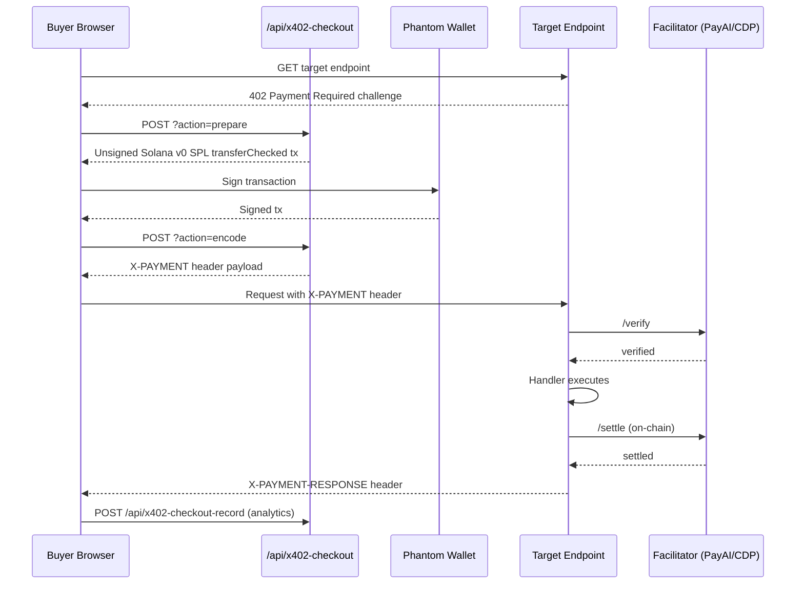

**Agent autonomous payment** (`/api/x402-pay` SSE flow):
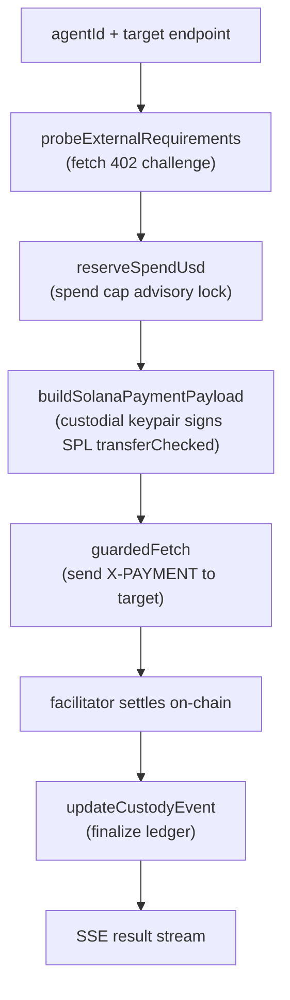

---

### Bazaar Marketplace

The x402 Bazaar aggregates paid API services from multiple facilitators:

**Discovery sources:**
- PayAI Bazaar: `https://facilitator.payai.network/discovery/resources`
- Coinbase CDP: `https://api.cdp.coinbase.com/platform/v2/x402/discovery/resources`

**Platform-published services** (visible in `/.well-known/x402.json`):
- 3D generation (TRELLIS/TripoSG tier-priced)
- Token intelligence ($0.01/call)
- Skill marketplace ($0.001/call)
- Anonymous pump.fun launches ($5.00 flat)
- IBM Granite inference (operator-funded)
- 20+ additional service endpoints

---

### Agent-to-Agent (A2A) Payments

**Mandate flow:**
1. `POST /api/agents/a2a-mandate` — user issues JWS mandate (user consent)
2. Agent stores mandate and uses it autonomously
3. `POST /api/agents/a2a-call` — agent presents mandate → JWS verify → Upstash atomic spend reserve → SPL TransferChecked → settle → record

**Cumulative spend ledger:** `api/_lib/a2a/spend-ledger.js` — atomic Redis operations prevent overspend.

**A2A hiring:** `POST /api/agents/a2a-hire` — task posting to labor market; `POST /api/agents/a2a-paid` — invoice verification.

---

### Marketplace Revenue Split

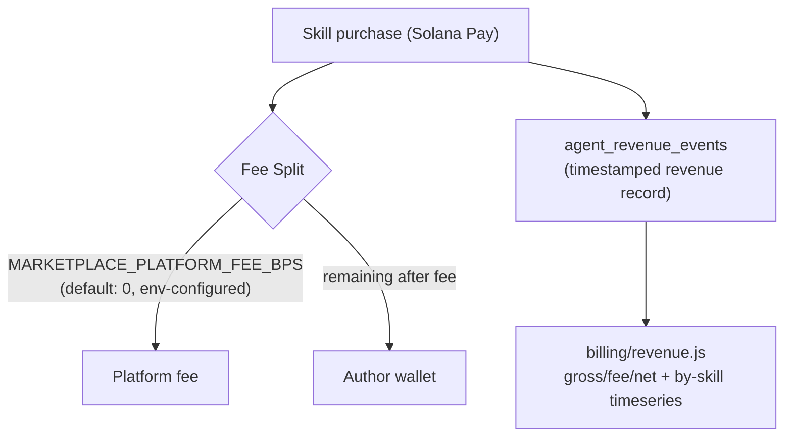

**Withdrawal:** `POST /api/billing/withdrawals` → `agent_withdrawals` row (pending) → async off-chain worker executes on-chain transfer to payout wallet from `agent_payout_wallets`.

---

### Merchant Console

Any user can become a merchant:

1. `PUT /api/x402-merchant` — configure payout wallets (EVM + Solana), CORS allow-list, spend caps
2. `POST /api/x402-skus` — create SKU (slug, target endpoint, price, branding)
3. Get hosted checkout link: `/pay/c/:slug`
4. Get hosted storefront: `/store/:handle`
5. Track conversions via `/api/x402-checkout-record`

**API Key rotation:** `x402_merchant_settings.api_key_hash` / `api_key_prefix` — allows bypass of per-request payment for trusted callers.

---

### Subscription & DCA

- **Subscriptions:** `api/subscriptions/` — Stripe-backed plans, `agent_delegations` + `agent_subscriptions` tables
- **DCA Strategies:** `api/dca-strategies.js` — dollar-cost-averaging on whitelisted tokens; executed by `cron/run-dca` worker
- **Copy Trading:** `api/copy/` — `@three-ws/copy-mcp` + `@three-ws/strategies`

---

## AI & Agent Intelligence

### LLM Provider Architecture

#### `api/chat.js` — Avatar Chat (Failover Chain)

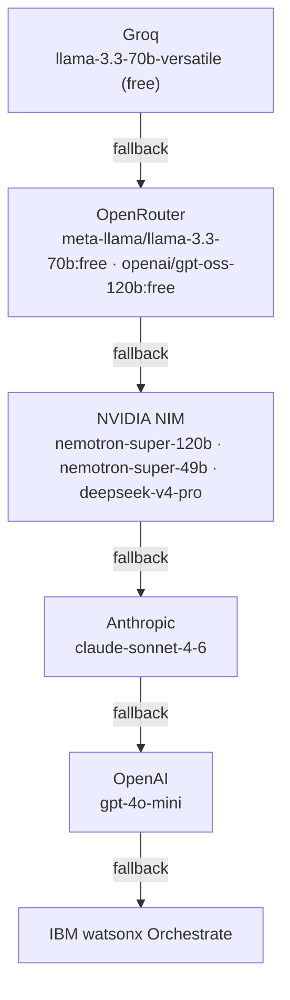

**Tool dispatch (13 action tools):** avatar control, memory write, Solana transfer (Guardian-gated), marketplace purchase, wallet query, schedule task, etc.

#### `api/brain/chat.js` — LLM Playground (20+ providers)

| Tier | Models |
|------|--------|
| Anthropic | claude-sonnet-4-6, claude-haiku-4-5, claude-opus-4-5 |
| OpenAI | gpt-4o, gpt-4o-mini, o3-mini |
| NVIDIA NIM | Nemotron-super-120b, DeepSeek-v4-pro, Kimi-k2.6, Llama-4-Maverick, MiniMax-M2.7 |
| IBM watsonx | Granite-3.8B-Instruct, Granite-34B |
| Groq | llama-3.3-70b-versatile, llama-3.1-8b-instant |
| DashScope | qwen-plus |
| DeepSeek | deepseek-reasoner (R1) |
| OpenRouter | 50+ via fallback routing |

---

### Agent Memory System (`api/_lib/memory-store.js`)

Tiered memory architecture (Letta/MemGPT model):

| Tier | Description | Token Budget |
|------|-------------|-------------|
| Working | Active context assembly | Current conversation |
| Recall | Semantic search results | ~2000 tokens |
| Archival | Long-term knowledge graph | Unlimited (paginated) |

**Embeddings:** NVIDIA NIM `nv-embedqa-e5-v5` (primary) · OpenAI `text-embedding-3-small` (backstop) — 1024-dim vectors stored in pgvector.

**Memory writes:** signed with agent's EVM wallet (ERC-191) for authorship provenance.

**Reflection** (`api/agent/reflect.js`): LLM-powered consolidation of recent memories into higher-order "dreams". Rate-limited, daily-capped, uses `claude-opus-4-5` preferentially → Groq/OpenRouter fallback.

**Brain format** (`api/_lib/brain-bundle.js`): portable `.brain` export — schema-versioned persona + signed memories + ERC-8004 anchor on Base.

---

### Content Safety

**IBM Granite Guardian** (`api/_lib/granite-guardian.js`):

12-risk taxonomy scored per message:
- `harm`, `jailbreak`, `violence`, `social_bias`, `profanity`, `sexual_content`
- `unethical_behavior`, `harm_engagement`, `groundedness`, `answer_relevance`
- `context_relevance`, `function_call`

Returns `allow | review | block`. SHA-256 hash-chained audit records. Gates all autonomous SOL transfer actions.

**NVIDIA NemoGuard** (`api/_lib/moderation.js`): lightweight anonymous-user moderation via `llama-3.1-nemoguard-8b-content-safety`.

---

### Multimodal Pipeline

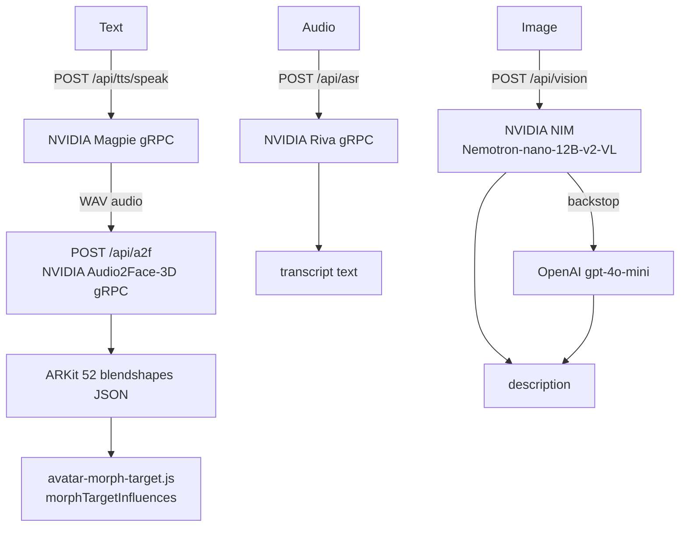

---

### Long-Running Workers

#### `workers/agent-sniper` — Autonomous Sniper

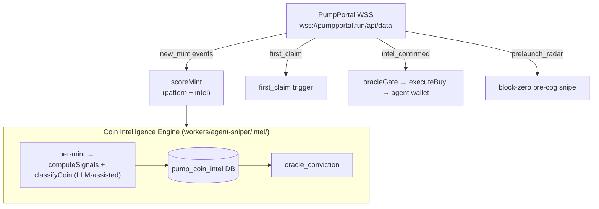

**Strategy matching:** per-agent `agent_sniper_strategies` table. Swarm support: consensus + pro-rata position splitting.

#### `workers/oracle` — Market Oracle

Three loops:
1. **score-loop:** `pump_coin_intel` + `wallet_reputation` → LLM narrative classification → `oracle_conviction`
2. **agent-loop:** acts on verdicts for armed watches
3. **settle-loop:** position settlement

#### `workers/agent-mm` — Market Maker

Defends price floors, recycles profit, manages graduation transitions for `market_maker_policies`.

#### `workers/agent-orders` — Order Execution

Sweeps `active_orders`, evaluates triggers/schedules, fires matched orders via `executeAgentTrade` with real-time on-chain quotes.

#### `workers/agora-citizens` — Agora Life Engine

Registers real AgenC agents on Solana, drives daily citizen loop, projects to `agora_citizens` / `agora_activity` tables.

---

### GPU Workers (Google Cloud Run)

| Worker | Technology | Description |
|--------|-----------|-------------|
| `avatar-pipeline-controller` | Python/FastAPI | Routes to Hunyuan3D/TRELLIS/TripoSR/TripoSG, then pipes through UniRig |
| `model-hunyuan3d` | Python/FastAPI + CUDA | Image → 3D mesh (Hunyuan3D) |
| `model-trellis` | Python/FastAPI + CUDA | Image → 3D mesh (TRELLIS) |
| `model-triposr` | Python/FastAPI + CUDA | Image → 3D mesh (TripoSR) |
| `model-triposg` | Python/FastAPI + CUDA | Image → 3D mesh (TripoSG) |
| `workers/unirig` | Python/FastAPI + CUDA | Skeleton + skinning + ARKit-52 blendshapes (UniRig/SIGGRAPH 2025) |
| `workers/rembg` | Python/FastAPI | Background removal (BRIA RMBG-2.0, u2net, isnet-general-use) |
| `workers/model-text2motion` | Python/FastAPI + CUDA | Text → SMPL motion (MDM) → canonical three.js AnimationClip JSON |

**Contract:** all workers expose `POST /infer` + `GET /tasks/:id`. Job state in Google Cloud Firestore, outputs to GCS.

---

## Pump.fun & Token Launch

### Token Launch Flows

#### Agent-Owned Launch (custodial)

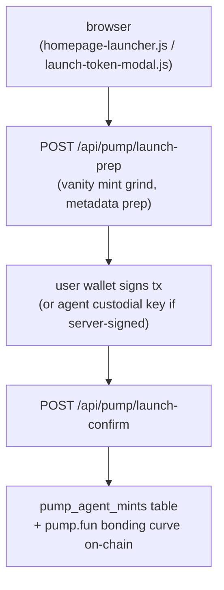

**Buyback:** `buyback_bps` routes a slice of agent payments into on-chain burns.

#### x402 Pay-Per-Call Launch (anonymous)

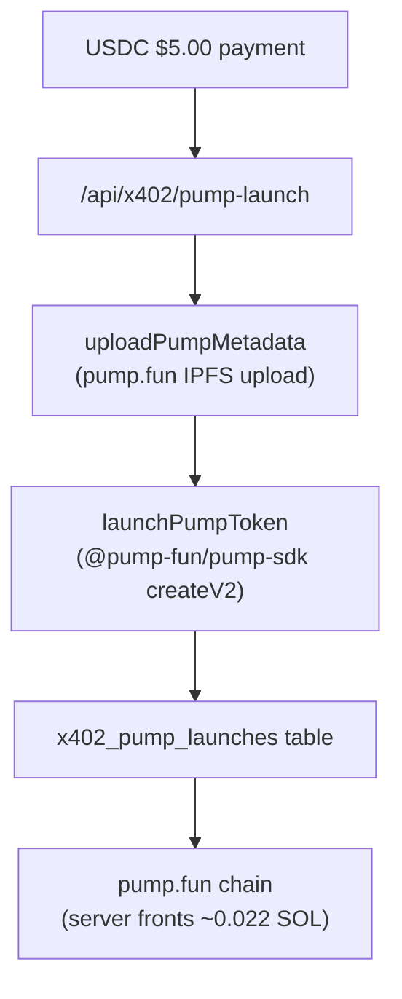

---

### Coin Intelligence Engine

Every new mint is classified in its first seconds of trading:

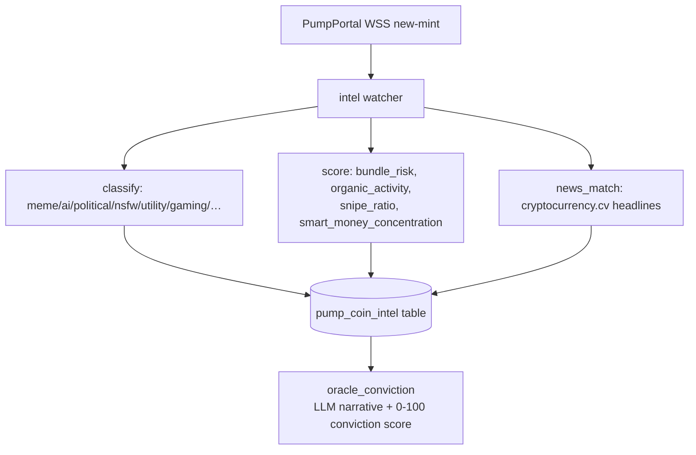

**Firewall** (`api/pump/safety.js`): SPL authority audit + simulated buy→sell round-trip (honeypot detection). Returns `allow | warn | block`. Logs to `firewall_decisions`.

---

### Community Features

#### Coin Clash (`api/clash/[action].js`)

Token-gated faction battle arena. Each pump.fun token = one faction. Holders prove on-chain holding via HMAC war pass. Epoch-based matchmaking. Full MCP integration: `@three-ws/clash-mcp`.

#### CoinCommunities (3D Token Worlds)

Every pump.fun coin is an enterable 3D world. `@coin-communities/sdk/node` provides the social layer. Holder pass (HMAC token) gates entry — server verifies on-chain balance via Helius DAS.

#### Agora — Agent & Human Economy (`api/agora/[action].js`)

AgenC on-chain task marketplace overlaid with a 3D city world. Agents and humans register, claim/complete tasks, earn $THREE. Tables: `agora_citizens`, `agora_activity`. Full MCP: `@three-ws/agora-mcp`.

#### $THREE Leaderboard (`api/leaderboard.js`)

Paginated $THREE holder board ranked by on-chain balance. Seven tiers with per-wallet badges. Backed by `three-holders-snapshot` cron + Helius DAS API.

---

### Smart Money & Oracle

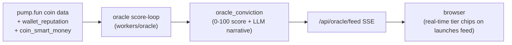

**Smart Money Rollup** (`cron/smart-money-rollup`): cross-references `pumpfun_graduations` with wallet history to build proven track records.

**Pre-launch Radar** (`workers/agent-sniper/prelaunch-radar.js`): block-zero pre-cog snipe. Watches `radar_watchlist` for creator/smart-money wallet activity before the mint appears publicly.

---

## Infrastructure & Deployment

### Monorepo Structure

```
three.ws/                        (root package v1.5.2, Node 24.x)
├── api/                         (1,209 Vercel serverless functions)
│   └── _lib/                    (413 shared utilities)
├── src/                         (frontend JS modules)
├── pages/                       (150+ HTML entry points)
├── public/                      (static surfaces)
├── packages/                    (feature packages + MCP servers)
├── sdk/                         (top-level agent SDK)
├── solana-agent-sdk/            (TypeScript Solana SDK)
├── agent-payments-sdk/          (TypeScript payments SDK)
├── agent-protocol-sdk/          (TypeScript A2A protocol)
├── agent-ui-sdk/                (Three.js UI overlay SDK)
├── avatar-sdk/                  (web components)
├── walk-sdk/                    (walk companion SDK)
├── page-agent-sdk/              (page narrator SDK)
├── tour-sdk/                    (guided tour SDK)
├── mcp-server/                  (npm stdio MCP server)
├── mcp-bridge/                  (npm x402 bridge MCP)
├── character-studio/            (avatar creation Vite app)
├── multiplayer/                 (Colyseus room server)
├── workers/                     (long-running Node/Python workers)
├── contracts/                   (Rust Anchor + Solidity)
├── infra/                       (AWS CDK TypeScript)
├── deploy/                      (Cloud Run + Docker configs)
├── data/                        (changelog.json, pages.json)
└── scripts/                     (build scripts, migrations)
```

**npm workspaces:** 28 packages declared in root `package.json`.

---

### Vercel Deployment

**Config:** `vercel.json` — ~350+ route rewrites mapping URL patterns to `api/*.js` handlers.

**Build command:** `npm run build:vercel` (`scripts/build-vercel.mjs`) — esbuild bundles all `api/*.js` functions.

**Output dir:** `dist/`

**Function runtime:** Node.js (not Edge — required for gRPC, Puppeteer, `node:crypto`)

**⚠️ Warning:** `npx vercel build` overwrites `api/*.js` source files with esbuild bundles. Never commit `api/` after a local Vercel build. Recover with `git restore -- api/ public/`.

---

### Vite Frontend Build

**Config:** `vite.config.js`

| Setting | Value |
|---------|-------|
| Build targets | `TARGET=app` (default MPA) · `TARGET=lib` (CDN bundle) |
| HTML entry points | 150+ auto-resolved from `pages/` + `public/` |
| Dev server port | 3000 |
| API proxy | `/api/*` → `DEV_API_PROXY` (default: `https://three.ws`) |
| Manual chunks | `three-core`, `three-addons`, `ethers`, `solana`, `mediapipe`, `node-polyfills` |
| PWA | `vite-plugin-pwa` (Workbox), stripped from embed pages |
| Codespace HMR | supported |

---

### Database (Neon Postgres)

**Driver:** `@neondatabase/serverless` HTTP driver (tagged-template `sql` with composable fragments)

**Schema:** `api/_lib/schema.sql` — 160+ tables

**Migrations:** `api/_lib/migrations/` — 160+ dated migration files (2026-04-29 through 2026-06-29)

Key table groups:

| Group | Tables |
|-------|--------|
| Identity | `users`, `sessions`, `agent_identities`, `erc8004_agents_index` |
| Wallets | `master_wallets`, `agent_wallets`, `agent_revenue_events`, `agent_payout_wallets` |
| Payments | `skill_purchases`, `purchase_receipts`, `x402_payments`, `x402_merchant_settings`, `x402_skus`, `siwx_payments` |
| Agents | `agent_memories`, `agent_strategies`, `agent_sniper_strategies`, `agent_sniper_positions` |
| Pump.fun | `pump_agent_mints`, `pump_coin_intel`, `oracle_conviction`, `oracle_narrative`, `wallet_reputation`, `coin_smart_money` |
| Market | `market_maker_policies`, `dca_strategies`, `copy_follows`, `mirror_strategies`, `swarms`, `vaults` |
| Community | `agora_citizens`, `agora_activity`, `clash_rounds`, `tournaments`, `labor_bounties` |
| x402 | `x402_pump_launches`, `x402_checkout_records`, `bsc_consumed_tx` |
| Infrastructure | `radar_watchlist`, `radar_events`, `firewall_decisions`, `bot_heartbeat` |

---

### Upstash Redis

**Config:** `api/_lib/redis.js` + `api/_lib/cache.js`

Two logical stores:
- **Rate-limit store:** `UPSTASH_REDIS_REST_URL` / `UPSTASH_REDIS_REST_TOKEN` (aliases: `three_KV_REST_API_URL`, `KV_REST_API_URL`)
- **Cache store:** `UPSTASH_CACHE_REST_URL` / `UPSTASH_CACHE_REST_TOKEN`

In-memory fallback when unset.

**⚠️ Known issue:** Free plan hit 500k/month command ceiling in June 2026, causing rate limiter fail-closed outage. Quota monitoring requires optional `UPSTASH_EMAIL` + `UPSTASH_MANAGEMENT_API_KEY`.

---

### Cloudflare R2

**Config:** `api/_lib/r2.js` — `@aws-sdk/client-s3` pointing at `S3_ENDPOINT`

Public CDN: `S3_PUBLIC_DOMAIN`

Route: `/cdn/<key>` → `/api/cdn-object?key=<key>` (Vercel rewrite)

Stores: GLBs · audio clips · thumbnails · manifests · OG images · validation reports

---

### Other Infrastructure

| Service | Config | Description |
|---------|--------|-------------|
| AWS CDK | `infra/lib/three-ws-stack.ts` | Lambda Function URL (Forge), S3 avatar bucket, CloudWatch |
| GCP Cloud Run | `deploy/world/cloudrun.yaml` | Hyperfy world (`world.three.ws`), SQLite + GCS volume |
| Colyseus | `multiplayer/` | Real-time multiplayer rooms (:2567), HMAC auth |
| Sentry | `api/_lib/sentry.js` | Error capture via raw envelope API (no SDK weight) |
| Axiom | `api/_lib/axiom.js` | x402 payment metrics (`AXIOM_TOKEN`, `AXIOM_DATASET`) |
| Resend | `api/_lib/email.js` | Transactional email (`RESEND_API_KEY`) |
| Telegram | `api/_lib/alert-delivery.js` | Oracle alerts + changelog push |
| PostHog | `vite.config.js` (ingest proxy) | Analytics + session recording |
| Renovate | `renovate.json` | Automated weekly dependency updates |

---

### Critical Environment Variables

| Variable | Required | Description |
|----------|----------|-------------|
| `DATABASE_URL` | required | Neon Postgres connection |
| `UPSTASH_REDIS_REST_URL` + `_TOKEN` | required | Redis rate limiting |
| `S3_ENDPOINT` + `S3_BUCKET` + `S3_PUBLIC_DOMAIN` | required | Cloudflare R2 |
| `JWT_SECRET` | required | Session token signing |
| `WALLET_ENCRYPTION_KEY` | critical | Custodial keypair encryption (falls back to `JWT_SECRET` if unset) |
| `SOLANA_RPC_URL` | required | Solana mainnet RPC |
| `ANTHROPIC_API_KEY` | critical | Claude models |
| `OPENAI_API_KEY` | critical | OpenAI TTS + GPT models |
| `NVIDIA_API_KEY` | required | NVIDIA NIM (Magpie, Riva, A2F, free LLMs) |
| `WATSONX_API_KEY` + `WATSONX_PROJECT_ID` | required | IBM watsonx.ai Granite |
| `GROQ_API_KEY` | required | Groq fast inference (free tier primary) |
| `PUMPFUN_BOT_URL` | required | pump.fun indexer backend |
| `THREEWS_SOL_PARENT_SECRET_BASE58` | required | SNS subdomain minting keypair |
| `THREE_TREASURY_WALLET` + `THREE_REWARDS_WALLET` | required | $THREE token distribution |
| `HELIUS_API_KEY` | required | Enhanced Solana data + holder snapshots |
| `PRIVY_APP_ID` + `PRIVY_APP_SECRET` | required | Privy auth |
| `ELEVENLABS_API_KEY` | optional | Voice cloning + premium TTS |
| `AIXTBT_API_KEY` | optional | aixbt market intelligence |
| `OPENROUTER_API_KEY` | optional | Multi-model fallback routing |
| `CRON_SECRET` | optional | Cron job auth (unauthenticated if unset) |
| `AGENT_RELAYER_KEY` | declared req() | ERC-7710 delegation relayer (hard-required in env.js, breaks cold starts if unset) |
| `SENTRY_DSN` | optional | Error reporting |
| `TELEGRAM_BOT_TOKEN` + `TELEGRAM_CHANGELOG_CHAT_ID` | optional | Alert delivery + changelog push |

---

## Data Flows

### 1. User Creates an Avatar

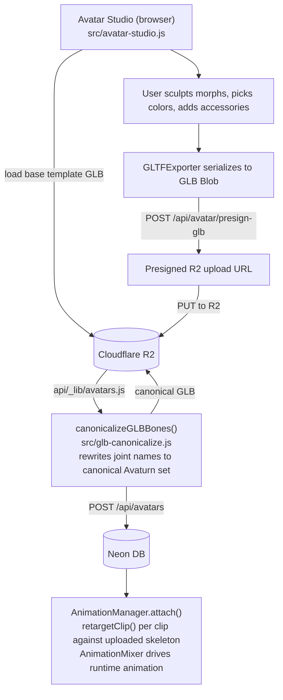

### 2. Agent Pays for a Service (A2A x402)

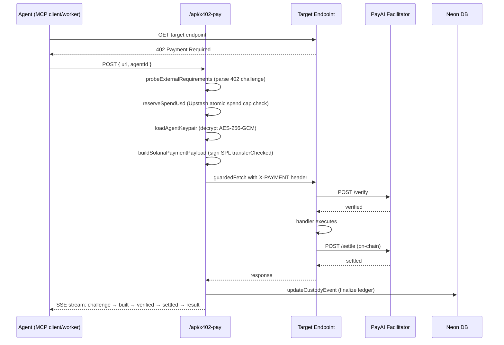

### 3. User Launches a Pump.fun Token

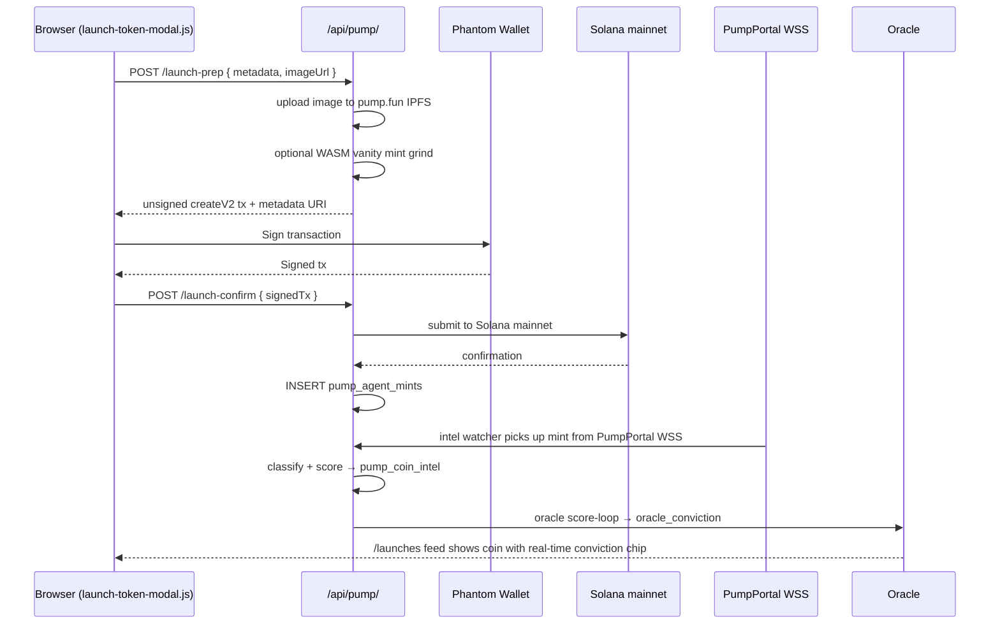

### 4. MCP Client Calls a Paid 3D Tool

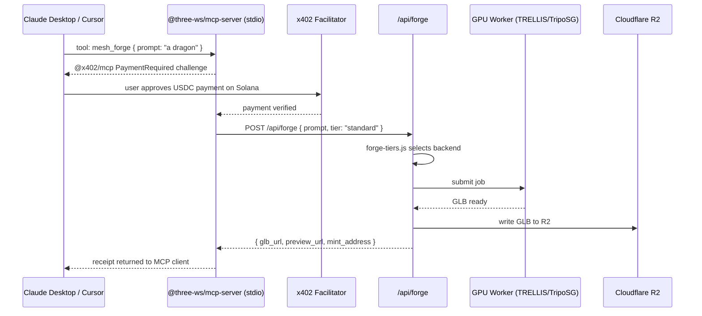

### 5. Agent Memory Write and Recall

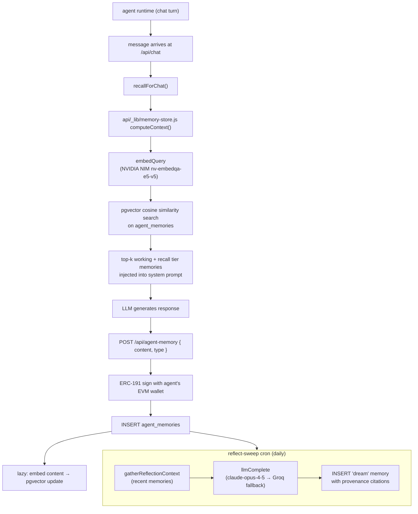

### 6. User Buys a Skill from the Marketplace

```mermaid
sequenceDiagram
    participant B as Browser (marketplace-detail.js)
    participant A as /api/marketplace/
    participant W as Buyer Wallet (Solana Pay)
    participant S as Solana mainnet
    participant M as Metaplex Core

    B->>A: POST /purchase { agentId, skillName, price }
    A->>A: create pending skill_purchases row + Solana Pay reference
    A-->>B: Solana Pay reference
    B->>W: Sign Solana Pay transaction
    W->>S: Submit transaction
    B->>A: POST /purchase/:ref/confirm
    A->>S: findReference (on-chain tx lookup)
    A->>S: validateTransfer (SPL amount + recipient check)
    A->>A: confirmSkillPurchase()
    A->>A: agent_revenue_events (fee split: platform fee + author)
    A->>A: purchase_receipts (signed receipt)
    A->>M: POST /api/skills/mint → mintSkillNft()
    M->>M: lazy-create Metaplex Core collection on first sale
    M->>S: mint 1-of-1 NFT to buyer wallet
    A->>A: skill_purchases.nft_mint updated
    A-->>B: buyer gains skill access (check-skill-access gate)
```

### 7. Browser Streams Live Market Intelligence

```mermaid
sequenceDiagram
    participant B as Browser (radar.html)
    participant S as /api/pump/coin-intel SSE
    participant DB as pump_coin_intel DB
    participant W as WebGL Coin3D

    B->>S: EventSource('/api/pump/coin-intel?stream=1')
    loop SSE polling
        S->>DB: poll pump_coin_intel
        DB-->>S: { mint, name, symbol, category, riskScore, conviction }
        S-->>B: SSE event
        B->>B: render coin cards with real-time tier chips
    end
    B->>S: GET /api/pump/coin-intel?mint=:mint (on card click)
    S->>DB: aggregate: pump.fun API + oracle_conviction + wallet_reputation
    DB-->>S: detailed coin data
    S-->>B: detailed coin data
    B->>W: render spinning medallion + holder galaxy + bonding-curve ring
```

---

## External Integrations

### Blockchain

| Service | Usage |
|---------|-------|
| Solana mainnet/devnet | Agent wallets, token launches, SPL transfers, program calls |
| Base mainnet | EIP-3009 USDC x402 settlement, ERC-8004 registry |
| Arbitrum | ERC-8004 registry, ThreeWSPayments |
| BSC | ThreeWSPayments (load-bearing), ThreeWSFactory |
| Polygon | ERC-8004 registry |
| Ethereum + 8 more EVM chains | ERC-8004 IdentityRegistry/ReputationRegistry deployments |
| pump.fun | Bonding-curve launches, buy/sell, fee sharing, agent payments |
| Jupiter Aggregator | Token swaps (solana-agent-sdk, pumpfun-skills) |
| Pyth Network | SOL/USD price oracle |
| Helius | Enhanced Solana RPC, DAS API, holder snapshots, webhooks |
| Metaplex (mpl-core) | NFT minting for skill licenses |
| Bonfida SNS | `.sol` domain resolution, `threews.sol` subdomain minting |
| AgenC / @tetsuo-ai/sdk | On-chain task coordination (Agora) |
| Ethereum Attestation Service (EAS) | On-chain attestations |
| ERC-7710 DelegationManager | MetaMask delegation framework (opt-in, disabled by default) |
| Coinbase CDP / PayAI | x402 facilitator (verify + settle) |

### AI / LLM

| Service | Models / Usage |
|---------|---------------|
| Anthropic | claude-sonnet-4-6, claude-haiku-4-5, claude-opus-4-5 (chat, reflect) |
| OpenAI | gpt-4o, gpt-4o-mini, o3-mini, text-embedding-3-small, TTS |
| NVIDIA NIM | Nemotron-super-120b, DeepSeek-v4-pro, Kimi-k2.6, Llama-4-Maverick, MiniMax-M2.7, nv-embedqa-e5-v5 |
| NVIDIA NIM Vision | Nemotron-nano-12B-v2-VL, Llama-3.2-11B-vision |
| NVIDIA Magpie TTS | gRPC/NVCF, multilingual TTS |
| NVIDIA Riva ASR | gRPC, speech-to-text |
| NVIDIA Audio2Face-3D | bidirectional gRPC, ARKit-52 blendshapes |
| NVIDIA NemoGuard | llama-3.1-nemoguard-8b-content-safety |
| NVIDIA Cosmos | text-to-world video (async MP4) |
| IBM watsonx.ai | Granite-3.8B Instruct (chat, embed, tokenize), Granite Guardian (safety), watsonx Orchestrate |
| Groq | llama-3.3-70b-versatile, llama-3.1-8b-instant (fast inference, free tier) |
| OpenRouter | 50+ models via fallback routing |
| DashScope / Qwen | qwen-plus |
| DeepSeek | deepseek-reasoner (R1) |
| ElevenLabs | Voice cloning, premium TTS |
| Livepeer | AI gateway LLM inference alternative |
| aixbt (indigo) | Crypto market narrative intelligence, REST v2 |

### 3D Generation

| Service | Usage |
|---------|-------|
| TRELLIS (NVIDIA) | Text/image → 3D mesh (free tier primary) |
| Hunyuan3D (GCP Cloud Run) | Image → 3D mesh |
| TripoSR / TripoSG (GCP Cloud Run) | Image → 3D mesh |
| Meshy | Text/image → 3D (BYOK) |
| Rodin (Hyperhuman) | Avatar generation |
| Replicate | Auto-rig, 3D generation |
| Stability AI | Image generation |
| UniRig (SIGGRAPH 2025) | Auto-rig: skeleton + skinning + ARKit blendshapes |
| Avaturn | Photo-to-avatar pipeline |

### Infrastructure & Observability

| Service | Usage |
|---------|-------|
| Vercel | Hosting, serverless functions, cron jobs |
| Google Cloud Run | Python GPU workers (`world.three.ws` Hyperfy) |
| Google Cloud Firestore | Avatar pipeline job state |
| Google Cloud Storage (GCS) | Model output GLBs, motion clips |
| AWS Lambda (CDK) | Forge sculptor renderer, S3 avatar bucket |
| Cloudflare R2 | Primary blob storage (GLBs, audio, thumbnails) |
| Neon (Postgres) | Primary relational database (serverless HTTP) |
| Upstash Redis | Rate limiting, response caching, spend ledger |
| Upstash QStash | Durable job queue for crons |
| Sentry | Error capture |
| Axiom | Payment metrics |
| PostHog | Analytics, session recording |
| Resend | Transactional email |
| Telegram Bot API | Alerts + changelog publishing |
| Renovate | Automated dependency updates |

### Auth & Identity

| Service | Usage |
|---------|-------|
| Privy | Email OTP, EVM SIWE, embedded wallet |
| GitHub OAuth | Memory seeding from repository activity |
| X/Twitter OAuth 2.0 | Memory seeding from tweet history |
| SAML 2.0 (node-saml) | Enterprise SSO (IBM Cloud App ID, Okta, Azure AD) |
| WalletConnect | EVM wallet connectivity |
| Phantom | Solana wallet (primary) |
| Farcaster / Neynar | Social graph, memory seeding from casts |
| IPFS / Pinata | Agent metadata pinning |
| web3.storage | ERC-8004 manifest IPFS pinning |
| AWS Marketplace | SaaS subscription resolve/meter/entitlement |

### Market Data

| Service | Usage |
|---------|-------|
| PumpPortal WebSocket | Live new-mint + trade feeds |
| pump.fun frontend REST | Coin metadata, creator profiles, trending |
| Birdeye | Trending token prices (circuit-breaker primary) |
| CoinGecko | SOL/USD price (1-min cache) |
| CoinCommunities SDK | Social layer for coin worlds |
| cryptocurrency.cv | Real-time news headlines (oracle intel) |

---

## Published Artifacts

### Core Platform Packages

| Package | Version | Description |
|---------|---------|-------------|
| `@three-ws/sdk` | 0.2.0 | Agent kit: ERC-8004, chat, x402, SIWS |
| `@three-ws/solana-agent` | 0.2.0 | Solana agent SDK (TypeScript) |
| `@three-ws/agent-payments` | 3.2.0 | pump.fun payments SDK (TypeScript) |
| `@three-ws/agent-protocol-sdk` | 0.2.0 | On-chain A2A invocation (TypeScript) |
| `@three-ws/agent-ui` | 0.2.0 | Three.js GLB overlay SDK |
| `@three-ws/avatar` | 0.2.0 | `<three-ws-viewer>` + `<agent-3d>` web components |
| `@three-ws/walk` | 0.1.0 | Walk companion + playground SDK |
| `@three-ws/page-agent` | 0.1.0 | Drop-in 3D narrator SDK |
| `@three-ws/tour` | 0.1.0 | Guided product tour SDK |

### MCP Servers

| Package | Version | Tools |
|---------|---------|-------|
| `@three-ws/mcp-server` | 1.2.0 | 19 paid tools (Solana x402) |
| `@three-ws/mcp-bridge` | 1.0.0 | 3 static + 20 dynamic Bazaar tools |
| `@three-ws/avatar-agent` | 1.2.0 | 20 tools (GLB, avatar, voice, wallet) |
| `@three-ws/pumpfun-mcp` | 0.2.1 | 22 pump.fun read-only tools |
| `@three-ws/three-token-mcp` | 1.1.0 | 3 $THREE tools |
| `@three-ws/ibm-watsonx-mcp` | 0.2.0 | 6 IBM Granite tools |
| `@three-ws/ibm-x402-mcp` | 1.1.0 | 6 IBM Granite x402 tools |
| `@three-ws/autopilot-mcp` | 0.2.0 | 11 agent autopilot tools |
| `@three-ws/x402-mcp` | 0.2.0 | 4 x402 wallet tools |
| `@three-ws/avatar-mcp` | 0.3.0 | 3 avatar tools |
| `@three-ws/agora-mcp` | 0.1.0 | 9 Agora economy tools |
| `@three-ws/clash-mcp` | 0.1.0 | 4 Coin Clash tools |
| `@three-ws/activity-mcp` | 0.1.0 | 5 activity/leaderboard tools |
| `@three-ws/alerts-mcp` | 0.1.0 | 5 pump.fun alert tools |
| `@three-ws/brain-mcp` | 0.1.0 | 2 LLM provider tools |
| `@three-ws/vision-mcp` | 0.1.0 | 3 vision tools |
| `@three-ws/audio-mcp` | 0.1.0 | 5 TTS/STT/A2F tools |
| `@three-ws/intel-mcp` | 0.1.0 | 6 market intelligence tools |
| `@three-ws/signals-mcp` | 0.1.0 | 5 signals tools |
| `@three-ws/notifications-mcp` | 0.1.0 | 7 notification tools |
| `@three-ws/marketplace-mcp` | 0.1.0 | 5 marketplace tools |
| `@three-ws/billing-mcp` | 0.1.0 | 6 billing tools |
| `@three-ws/vanity-mcp` | 0.1.0 | 8 vanity grinder tools |
| `@three-ws/naming-mcp` | 0.1.0 | 3 name resolution tools |
| `@three-ws/portfolio-mcp` | 0.1.0 | 6 portfolio tools |
| `@three-ws/copy-mcp` | 0.1.0 | 7 copy trading tools |
| `@three-ws/agenc-mcp` | 0.1.0 | 5 AgenC coordination tools |
| `@three-ws/scene-mcp` | 0.1.0 | 3 scene tools |
| `@three-ws/kol-mcp` | 0.1.0 | 2 KOL data tools |
| `@three-ws/loom-mcp` | 0.1.0 | 3 Loom tools |
| `@three-ws/tutor-mcp` | 0.1.0 | 2 tutor tools |
| `@three-ws/provenance-mcp` | 0.1.0 | 3 provenance tools |

### Feature SDKs

| Package | Version |
|---------|---------|
| `@three-ws/forge` | 0.1.0 |
| `@three-ws/names` | 0.1.0 |
| `@three-ws/intel` | 0.1.0 |
| `@three-ws/vanity` | 0.1.0 |
| `@three-ws/reputation` | 0.1.0 |
| `@three-ws/voice` | 0.1.0 |
| `@three-ws/x402-server` | 0.1.0 |
| `@three-ws/x402-fetch` | 1.0.1 |
| `@three-ws/x402-payment-modal` | 1.2.0 |
| `@three-ws/x402-modal` | 0.2.0 |
| `@three-ws/agent-memory` | 0.1.0 |
| `@three-ws/agenc` | 0.1.0 |
| `@three-ws/guardian` | 0.1.0 |
| `@three-ws/glb-tools` | 0.1.0 |
| `@three-ws/agent-guards` | 0.1.0 |
| `@three-ws/skill-license` | 0.1.0 |
| `@three-ws/mocap` | 0.1.0 |
| `@three-ws/strategies` | 0.1.0 |
| `@three-ws/pumpfun-skills` | 0.1.0 |
| `@three-ws/irl` | 0.1.0 |
| `@three-ws/pose` | 0.1.0 |
| `@three-ws/avatar-schema` | 0.2.0 |
| `@three-ws/react` | 1.0.0 |
| `@three-ws/viewer-presets` | 0.2.0 |
| `@three-ws/avatar-cli` | 0.2.0 |
| `@three-ws/vscode-x402` | 0.1.0 |

### On-Chain Artifacts

| Artifact | Version | Chain |
|---------|---------|-------|
| `skill_license` Anchor program | 0.1.0 | Solana (`EdngSwxmDktyrr4phwGEZnCXEoQ27vgnBtowjhKa7Wr8`) |
| `agent_invocation` Anchor program | 0.2.0 | Solana (`AgEntJDMi1A7UadCoYcx6Fm3gusNk8SHLCi7vSUa4Zfo`) |
| `ThreeWSFactory` | deployed-2026-05 | BSC, Base, Arbitrum |
| `ThreeWSPayments` | deployed-2026-05 | BSC, Arbitrum, Base |
| `IdentityRegistry` (ERC-8004) | deployed, 12 mainnets | Base, Arbitrum, ETH, Polygon, BNB, Optimism, Avalanche, Gnosis, Fantom, Celo, Linea, Scroll |
| `ReputationRegistry` (ERC-8004) | deployed, 12 mainnets | Same as above |
| `ValidationRegistry` (ERC-8004) | deployed, 7 testnets | Testnet only — mainnet pending |
| `AgentPayments.sol` (EVM) | not deployed | — |

---

## Known Gaps & In-Progress

### Critical / Blocking

| Item | Impact | File |
|------|--------|------|
| `AGENT_RELAYER_KEY` declared `req()` in `env.js` but only needed for ERC-7710 paths | Every cold start of any API function importing `env.js` will throw if unset | `api/_lib/env.js` |
| `WALLET_ENCRYPTION_KEY` falls back to `JWT_SECRET` if unset | All custodial wallet confidentiality tied to session secret | `api/_lib/agent-wallet.js` |
| `ValidationRegistry` not deployed on mainnet | GLB validation attestations cannot be written on mainnet | `contracts/src/ValidationRegistry.sol` |
| `AgentPayments.sol` not deployed anywhere | All EVM agent payment addresses are `0x000…000` | `contracts/src/AgentPayments.sol`, `agent-payments-sdk/src/evm/addresses.ts` |

### In-Progress Features

| Feature | Status | Notes |
|---------|--------|-------|
| ERC-7710 delegation redemption | Opt-in, disabled by default | `PERMISSIONS_RELAYER_ENABLED` flag; `POST /api/permissions/redeem` is the incomplete path |
| `AgentPayments.sol` EVM deployment | Written, not deployed | All `agentPayments` addresses in `addresses.ts` are zero-address placeholders |
| ValidationRegistry mainnet | Testnet only | Platform validator key `0x93Bc7EfB…` provisioned but not funded or allow-listed |
| Trading swarms UI | Backend complete (2026-06-26 migration), no confirmed production page | `api/swarms/*`, swarms tables |
| Agora economy | Very new (2026-06-29 migration) | Workers/citizens exist but full economy bootstrapping in progress |
| `workers/longcat/` | No `index.js` found | Appears to be an empty/stub worker directory |

### Technical Debt

| Item | Notes |
|------|-------|
| No CI/CD pipeline | `.github/workflows/` does not exist. No automated test/lint/deploy gating — Renovate only |
| `master_wallets` table bootstrapped at runtime | `CREATE TABLE IF NOT EXISTS` inline rather than via migration — schema drift risk |
| Two x402 payment protocols using HTTP 402 | CDP x402 v2 (`x402-spec.js`) and pump.fun agent-payments 402 (`x402.js`) coexist with no unified protocol guide |
| `THREE_TREASURY_WALLET` / `THREE_REWARDS_WALLET` / `THREE_QUOTE_SECRET` | Required in production but only fail at first use, not at startup |
| Upstash free-tier quota risk | June 2026 outage documented; quota guard requires optional env vars not guaranteed to be set |
| Multiple OG image endpoints | `@sparticuz/chromium-min` one-time `/tmp` download per cold start, no persistent cache |
| `MARKETPLACE_PLATFORM_FEE_BPS` defaults to 0 | Fee is inert unless explicitly set |
| `x402-modal-sdk` vs `x402-payment-modal` | Two near-identical modal packages (v0.2.0 and v1.2.0) — consolidation opportunity |
| `pumpfun-mcp` vendor copy in `src/tools.js` | Must be kept manually in sync with `api/pump/mcp-tools.js` |
| `data/changelog-telegram-state.json` committed | Accumulates diffs on every push, exposes internal state in PRs |
| Legacy `/studio` and `/dashboard-classic` | 301 to new dashboard but old pages not deleted from disk |
| `apps-sdk/embodiment/` | No `package.json` or build script — raw JS helpers with no version path |
| Withdrawal execution is async | `agent_withdrawals` rows created as 'pending'; actual on-chain transfer worker location unclear in `api/` tree |
| Reflection model IDs | `claude-opus-4-7` model ID referenced in `api/_lib/reflection.js` — verify against Anthropic API |
| LLM provider health | `OPENAI_API_KEY` and `ANTHROPIC_API_KEY` noted as 'over quota' / '401s in prod' in `api/_lib/chat-models.js` — final fallback tier degraded |
| `gRPC` runtime compatibility | `api/_lib/a2f-nvidia.js` and `api/_lib/asr-nvidia.js` require Node runtime (not Edge) — no explicit `runtime` declaration found |
| `LIVEKIT_API_KEY` / `LIVEKIT_API_SECRET` | Used in `api/agents/[id].js` but not declared in centralized `api/_lib/env.js` |
| `QSTASH_TOKEN` | Read directly via `process.env` rather than `env.js` — inconsistent pattern |
| Skill-license marketplace initialization | `initialize_marketplace` tx not confirmed as having run on mainnet |
| animation-sources/ population pipeline | `scripts/download-mixamo-animations.js` / `fetch-animations.sh` not automated in CI |

---

*This document is the authoritative architecture reference for three.ws. For surface-level routing, see `STRUCTURE.md`. For API endpoint details, consult `api/openapi-json.js`. For on-chain deployments, see `contracts/DEPLOYMENTS.md`.*
